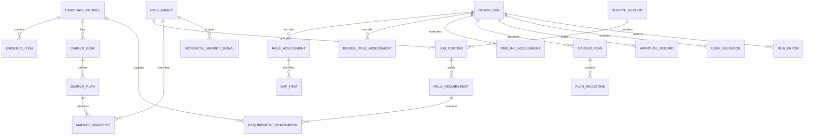

# Conceptual Domain Data Model

## Activity 8 market provenance

`SourceRecord.source_type` distinguishes `ADZUNA` primary records from `YOU` supporting records.
The service-level `MarketPostingEvidence` groups a posting, its primary source/content, supporting
sources/contents, enrichment status, and limitations without expanding the durable career domain.
Requirement provenance continues from `RoleRequirement.posting_id` through this evidence chain.

## Activity 8 market provenance

`SourceRecord.source_type` distinguishes `ADZUNA` primary records from `YOU` supporting records.
The service-level `MarketPostingEvidence` groups one posting, its primary source/content, optional
supporting sources/content, enrichment status, and limitations. Requirement provenance continues
from `RoleRequirement.posting_id` through this evidence chain; the durable career domain is not
expanded.

## 1. Purpose

This document defines the conceptual MVP domain model. It separates confirmed candidate facts and retained evidence from derived analysis, planning records, and workflow/audit records. It does not define SQL types, tables, migrations, ORM syntax, Pydantic models, or implementation code.

A derived analysis record is authoritative as a record of what the system concluded during a particular run. It is not an authoritative fact about the person or objective market.

## 2. Data Classifications

- **`CONFIRMED_FACT`:** User-confirmed candidate facts and evidence, such as employment, education, and projects.
- **`USER_INTENT`:** User-confirmed desired future direction, preference, constraint, or target. It is authoritative as a record of what the user wants, not an objective fact about the user or market.
- **`RETAINED_EVIDENCE`:** Externally retrieved source records, job postings, and historical or labor-market source references.
- **`DERIVED_ANALYSIS`:** Interpretations calculated from facts and evidence, including requirements, snapshots, comparisons, gaps, accessibility, bridge, and timeline assessments.
- **`PLAN_RECORD`:** Draft and approved career plans and milestones.
- **`WORKFLOW_AUDIT`:** Runs, approvals, feedback, and errors retained for traceability.

Retained market evidence is distinct from derived market interpretation:

- `SourceRecord`, `JobPosting`, and underlying historical/labor-market source references are retained evidence.
- `RoleRequirement` is structured extraction from a `JobPosting` and is derived analysis; it retains its source posting reference.
- `MarketSnapshot` is a calculated summary of validated current postings and is derived analysis.
- `HistoricalMarketSignal` is a calculated interpretation of historical evidence and is derived analysis.

The authority distinction is: `CONFIRMED_FACT` records what the user has done or confirmed about their history; `USER_INTENT` records what the user wants; `RETAINED_EVIDENCE` records what external sources provide; `DERIVED_ANALYSIS` records what the system concludes; `PLAN_RECORD` records what the system proposes; and `WORKFLOW_AUDIT` records what happened during the workflow.

## 3. Entity Overview

| Entity | Classification | Source of truth | PII | User approval | Authority |
|---|---|---|---|---|---|
| CandidateProfile | CONFIRMED_FACT | SQLite after confirmation | High/career-sensitive | Required | Confirmed candidate record |
| EvidenceItem | CONFIRMED_FACT | SQLite after confirmation | High/career-sensitive | Required where inferred | Confirmed or auditable evidence |
| CareerGoal | USER_INTENT | SQLite after approval | Career-sensitive | Required | Approved user goal |
| SearchPlan | DERIVED_ANALYSIS / workflow support | Run record and SQLite if retained | Usually none | No | Reproducible search plan |
| SourceRecord | RETAINED_EVIDENCE | SQLite/source store | Usually none | No | Retained external source |
| JobPosting | RETAINED_EVIDENCE | SQLite/source store | Usually none | No | Retained market evidence |
| RoleFamily | RETAINED_EVIDENCE / reference interpretation | SQLite/reference data | None | Human review may be required | Preserved mapping with confidence |
| RoleRequirement | DERIVED_ANALYSIS | SQLite with posting reference | Usually none | No | Derived extraction |
| MarketSnapshot | DERIVED_ANALYSIS | SQLite with source references | None unless linked | No | Current-market run conclusion |
| HistoricalMarketSignal | DERIVED_ANALYSIS | SQLite with source references | None unless linked | No | Historical-market run conclusion |
| RequirementComparison | DERIVED_ANALYSIS | SQLite with profile/goal/run provenance | Career-sensitive | No | Run-scoped comparison |
| TransferableSkillAssessment | DERIVED_ANALYSIS | SQLite with evidence references | Career-sensitive | No, but inference dependency is retained | Run-scoped interpretation |
| GapItem | DERIVED_ANALYSIS | SQLite with requirement/evidence references | Career-sensitive | No | Run-scoped gap conclusion |
| RoleAssessment | DERIVED_ANALYSIS | SQLite with run and source provenance | Career-sensitive | No | Run-scoped role conclusion |
| BridgeRoleAssessment | DERIVED_ANALYSIS | SQLite with run and market provenance | Career-sensitive | No | Run-scoped bridge conclusion |
| TimelineAssessment | DERIVED_ANALYSIS | SQLite with goal and evidence provenance | Career-sensitive | No | Run-scoped timeline conclusion |
| CareerPlan | PLAN_RECORD | SQLite after approval | Career-sensitive | Required for approval | Draft or approved plan |
| PlanMilestone | PLAN_RECORD | SQLite through plan | Career-sensitive | Covered by plan approval | Plan component |
| UserFeedback | WORKFLOW_AUDIT / contextual input | SQLite if retained | Career-sensitive | User action | Traceability record |
| ApprovalRecord | WORKFLOW_AUDIT | SQLite | Career-sensitive | Represents approval | Audit record |
| GraphRun | WORKFLOW_AUDIT | SQLite if retained | Indirect | No | Retained run audit |
| RunError | WORKFLOW_AUDIT | SQLite/log store | May contain sensitive diagnostics | No | Retained error audit |

## 4. Candidate Entities

### CandidateProfile

**Purpose:** Represents the user's confirmed career profile.

**Key fields:** `profile_id` (identifier, required), `user_id` (identifier, required), `profile_version` (version, required), `career_stage` (bounded classification, required), `professional_summary` (text, optional), `core_competencies` (candidate-entered text, optional), `current_role` (text, optional), `current_seniority` (classification, optional), `current_location` (structured value, optional), `work_authorization_status` (sensitive classification, optional and voluntary), collections of education/employment/internship/project/volunteer/certification/capability/leadership references, `portfolio_links` (references, optional), `profile_status` (bounded classification, required), timestamps, and `supersedes_profile_id` (reference, optional).

**Validation:** A confirmed profile is complete enough for its stated analysis; inferred capabilities are not silently facts; sensitive fields are minimized; status transitions are valid; referenced evidence belongs to the profile.

**Authority and approval:** SQLite is the source of truth after user confirmation. High PII and career-sensitive data. User approval is required. Classification: `CONFIRMED_FACT`.

**Relationships/versioning:** One user may have many versions; one profile has many evidence items and goals. Confirmed versions are immutable; corrections create a new version linked by `supersedes_profile_id`.

### EvidenceItem

**Purpose:** Represents evidence supporting a capability, experience, responsibility, or outcome.

**Key fields:** `evidence_id` (identifier, required), `profile_id` (reference, required), `evidence_type` (classification, required), `source_type` and `source_reference` (provenance, required), `capability` and `description` (text, required), `maturity_level` (classification, required), `context` (text, optional), dates (optional), `outcome` and `metric` (text, optional), `confirmation_status` (classification, required), `confidence` (classification, required), `approved_by_user` (approval flag, required), `created_at` (timestamp, required).

**Validation:** Rejected inferences remain auditable but cannot support candidate analysis; maturity cannot exceed evidence; projects are not automatically production experience; source references are retained.

**Authority and approval:** SQLite after confirmation. High or career-sensitive PII depending on source. Explicit or inferred evidence requires appropriate user approval. Classification: `CONFIRMED_FACT` when confirmed, otherwise auditable non-authoritative evidence.

**Relationships/versioning:** Belongs to one profile; may support many comparisons, gaps, and assessments. Confirmed evidence is immutable within a confirmed profile version.

### CareerGoal

**Purpose:** Represents an approved user goal and related preferences, not an objective candidate fact.

**Key fields:** `goal_id`, `profile_id`, `goal_version`, `goal_type`, `target_role`, `target_role_family_id`, `target_seniority`, `target_timeline_months`, `target_location`, `target_industries`, `preferred_work_modes`, `bridge_role_willingness`, `search_expansion_permission`, `exploration_mode`, `exclusions`, approval status, timestamps, and `supersedes_goal_id`.

**Validation:** Goal type is recognized; target, scope, and timeline are clear when relevant; approval precedes authoritative use; changing role, timeline, or geography invalidates affected analysis.

**Authority and approval:** SQLite after user approval. Career-sensitive data. Approval required. Classification: `USER_INTENT`, authoritative as a record of what the user wants rather than an objective candidate fact.

**Relationships/versioning:** A profile has many goal versions; a goal has many search plans and analysis records. Approved goals are versioned and immutable.

## 5. Market Entities

### SearchPlan

**Purpose:** Defines a reproducible current-market search derived from an approved goal and context.

**Key fields:** `search_plan_id`, `goal_id`, geography, exact/related/role-family query collections, career-stage/seniority/work-mode/industry filters, freshness window, maximum results, expansion rules, and creation timestamp.

**Validation:** Search expansion respects permission; query scope is explicit; plan can be reproduced; it does not claim complete market coverage.

**Authority and approval:** Run record or SQLite if retained; no PII by default; no user approval. Classification: `DERIVED_ANALYSIS` / workflow support.

**Relationships/versioning:** Belongs to a goal and produces market snapshots and source references. Each plan is immutable after execution for reproducibility.

### SourceRecord

**Purpose:** Represents a retrieved external evidence source.

**Key fields:** `source_id`, source type, title, URL or locator, employer, geography, retrieval and publication dates, content hash, source quality, employer-source flag, accessibility, expiry signal, retrieval status, and limitations.

**Validation:** Source identity and retrieval metadata are retained; status is valid; inaccessible or partial content is marked; original source is not overwritten by normalization.

**Authority and approval:** SQLite or controlled source store. Usually public/non-PII, though links can contain sensitive context. No user approval. Classification: `RETAINED_EVIDENCE`.

**Relationships/versioning:** A source may support many postings, requirements, snapshots, signals, and analyses. Retain by retrieval date/version rather than overwriting.

### JobPosting

**Purpose:** Represents a retained current job posting.

**Key fields:** `posting_id`, `source_id`, original title, normalized title (optional interpretation), `role_family_id`, employer, location, work mode, employment type, seniority, optional salary information, posting/closing/retrieval dates, active status, duplicate group, requirement references, and extraction confidence.

**Validation:** Original title is preserved; source is retained; duplicates do not inflate counts; active/expired status is explicit; posting evidence is not candidate analysis.

**Authority and approval:** SQLite/source store. Usually public/non-PII. No user approval. Classification: `RETAINED_EVIDENCE`.

**Relationships/versioning:** Belongs to a source and role family; has many requirements; contributes to snapshots. Retained as observed at retrieval time.

### RoleFamily

**Purpose:** Groups related work and titles for analysis without claiming title equivalence.

**Key fields:** `role_family_id`, canonical title, alternative titles, occupation code/taxonomy, description, typical seniority levels, normalization confidence/method, and human-review status.

**Validation:** Mapping preserves original titles; similarity alone is insufficient; occupational mapping may be unavailable; confidence and review status are visible.

**Authority and approval:** Reference data retained in SQLite; no PII; human review may be required, but no candidate approval. Classification: retained reference/evidence interpretation.

**Relationships/versioning:** One role family may contain many postings, snapshots, requirements, and assessments. Mappings are versioned when changed.

### RoleRequirement

**Purpose:** Structured extraction of one grounded statement from a retained job posting. It is derived market interpretation, not original evidence.

**Key fields:** `requirement_id`, `posting_id`, statement type (`ROLE_RESPONSIBILITY`, `HIRING_CAPABILITY`, `PREREQUISITE`, `PREFERENCE`, or `METADATA_NON_REQUIREMENT`), category, original text, normalized capability, mandatory/preferred flags, years required, maturity expected, frequency within sample, and extraction confidence.

**Validation:** Posting reference is required; original text is retained; mandatory and preferred remain distinct; frequency is limited to the analyzed sample; extraction uncertainty is visible.

**Authority and approval:** SQLite with source posting reference. Usually non-PII. No user approval. Classification: `DERIVED_ANALYSIS`.

**Relationships/versioning:** Belongs to one posting. Only hiring capabilities and prerequisites may enter comparison; responsibilities and preferences remain canonical role context. Re-extraction creates a new interpretation version while retaining the source.

### CanonicalTargetRoleProfile

**Purpose:** Consolidates posting-level evidence into an auditable role baseline without confusing
role duties with candidate qualifications.

**Key fields:** role responsibilities, hiring requirements, prerequisites, preferences, optional
and related context, responsibility and qualification support counts, independent employer and
posting counts, exact/variant/related support, provider/source provenance, source quotes,
confidence, and profile status.

**Validation:** One real cross-source job contributes one posting and one employer signal while
retaining multiple provenance records. Standard-level evidence defines an unspecified-seniority
baseline. Background guides and responsibility-only statements cannot enter comparison.

### MarketSnapshot

**Purpose:** Calculated summary of validated current postings for a search run.

**Key fields:** `snapshot_id`, `search_plan_id`, role family, geography, snapshot date, exact and related posting counts, validated count, distinct and normalized employer counts, Opportunity Availability, Employer Diversity, Market Concentration, Evidence Confidence, search/content retrieval counts, duplicate count, source IDs, and limitations. Historical persistence and higher-order Market Verdict are not current-snapshot fields.

**Validation:** Counts reflect validated searched results, not total market jobs; deduplication precedes counts; exact and related scopes remain distinct; signal labels retain their supporting posting, employer, retrieval, and duplicate counts; source and limitation references are present.

**Authority and approval:** SQLite as a retained market-analysis record. No PII unless linked to a user. No user approval. Classification: `DERIVED_ANALYSIS`.

**Relationships/versioning:** Produced by a search plan; references sources, postings, requirements, and role family. Versioned by search date/run, never silently overwritten.

### HistoricalMarketSignal

**Purpose:** Calculated interpretation of historical market evidence.

**Key fields:** `historical_signal_id`, role family, geography, period start/end, observation frequency, activity observations, median volume, persistence, trend, seasonality, employer concentration, scope type, source IDs, confidence, limitations, and creation timestamp.

**Validation:** Exact, related, role-family, and occupational scope remain distinct; broader substitution is disclosed; weekly/monthly/quarterly observations are not treated as equivalent; missing periods are not fabricated; unavailable evidence is valid.

**Authority and approval:** SQLite as a derived run conclusion with historical source references. No PII unless linked. No user approval. Classification: `DERIVED_ANALYSIS`.

**Relationships/versioning:** References historical source records and may be paired with a current snapshot. Versioned by observed period, source, and run.

## 6. Analysis Entities

### RequirementComparison

**Purpose:** Compares one role requirement with confirmed candidate evidence.

**Key fields:** comparison ID, profile and goal references, requirement reference, evidence references, candidate/target maturity, match type, transferable capability, remaining difference, confidence, and creation timestamp.

**Validation:** Uses confirmed evidence or approved inferences only; unconfirmed/rejected inferences cannot support a match; maturity, scale, domain, and scope are preserved; source references remain available.

**Authority and approval:** SQLite run record. Career-sensitive. No separate approval. Classification: `DERIVED_ANALYSIS`.

**Relationships/versioning:** Links one requirement to one profile version and goal version; many comparisons form a role assessment. Run-scoped and immutable after creation.

### TransferableSkillAssessment

**Purpose:** Explains an evidence-supported capability transfer between source and target contexts.

**Key fields:** assessment ID, profile, role family, capability, supporting evidence IDs, source/target contexts, current/target maturity, explanation, confidence, confirmation dependency, and timestamp.

**Validation:** Transferability is evidence-supported, not title-based; differences and confirmation dependency remain explicit; no hidden numeric probability.

**Authority and approval:** SQLite run record. Career-sensitive. Approval may be required for profile inferences before they become facts. Classification: `DERIVED_ANALYSIS`.

**Relationships/versioning:** References profile evidence and target role family; supports comparisons, gaps, and role assessments. Run-scoped.

### GapItem

**Purpose:** Classifies a remaining difference between candidate evidence and a role requirement.

**Key fields:** gap ID, role assessment, requirement, category, current evidence/maturity, target expectation, remaining difference, severity, hard-blocker flag, evidence needed, possible action, and confidence.

**Validation:** Uses exactly the approved categories and severities; preferred requirements are not blockers; missing evidence is not automatically missing experience; explanations and sources are retained.

**Authority and approval:** SQLite run record. Career-sensitive. No separate approval. Classification: `DERIVED_ANALYSIS`.

**Relationships/versioning:** Belongs to a role assessment and requirement; may link to plan milestones. Run-scoped and provenance-linked.

### RoleAssessment

**Purpose:** Records the system's conclusion about one candidate and role during a run.

**Key fields:** role assessment ID, run/profile/goal/role-family references, market snapshot, comparison IDs, transferable-skill IDs, gap IDs, blocker IDs, candidate accessibility, market verdict, role category, explanation, confidence, sources, and timestamp.

**Validation:** Candidate accessibility and market verdict remain separate; role category respects bridge-analysis sequencing; all derived claims have provenance; profile and goal versions are explicit.

**Authority and approval:** SQLite run record. Career-sensitive. No separate approval. Classification: `DERIVED_ANALYSIS`.

**Relationships/versioning:** A run may have many role assessments; each references comparisons, gaps, market evidence, and potentially bridge/timeline assessments. Immutable per run.

### BridgeRoleAssessment

**Purpose:** Evaluates whether an intermediate role is useful and credible for a target path.

**Key fields:** assessment ID, run, source/target/bridge role families, strength overlap, gap reduction, capability gain, market availability, candidate accessibility, evidence value, leadership/scope gain, constraint fit, blockers, outcome, explanation, confidence, and timestamp.

**Validation:** Bridge is not merely the nearest title; direct paths can produce `NO_BRIDGE_REQUIRED`; multiple, no-valid-bridge, and insufficient-evidence outcomes are supported; no numeric recommendation probability.

**Authority and approval:** SQLite run record. Career-sensitive. No separate approval. Classification: `DERIVED_ANALYSIS`.

**Relationships/versioning:** Belongs to a run and links source/target role families; may be referenced by timeline and plan records. Immutable per run.

### TimelineAssessment

**Purpose:** Assesses a requested timeline using evidence, gaps, blockers, market conditions, and bridge findings.

**Key fields:** assessment ID, run/goal references, requested months, classification, assumptions, blocking gaps, milestones, bridge-required flag, market dependencies, confidence, limitations, and timestamp.

**Validation:** Uses approved classifications; assumptions and limitations are required; it does not guarantee outcomes; it references the intended goal and relevant run.

**Authority and approval:** SQLite run record. Career-sensitive. No separate approval. Classification: `DERIVED_ANALYSIS`.

**Relationships/versioning:** Belongs to a goal evaluation and may be referenced by a career plan. A run may have zero or one per target evaluation; versioned when inputs change.

## 7. Planning Entities

### CareerPlan

**Purpose:** Represents a draft or approved Career Strategy Plan.

**Key fields:** plan ID, run/profile/goal references, plan version, status, path type, role/bridge/timeline assessment references, recommended path, milestone IDs, risks, assumptions, source IDs, confidence, approval status, timestamps, and superseded plan reference.

**Validation:** Draft is non-authoritative; approval is required before active status; plan references belong to the same relevant run/profile/goal versions; source limitations remain visible; approved plans are immutable.

**Authority and approval:** SQLite. Career-sensitive. Final user approval required. Classification: `PLAN_RECORD`.

**Relationships/versioning:** Belongs to a run, profile version, and goal version; has many milestones and may reference many analysis records. Versioned; approved versions are immutable; revisions create new versions.

### PlanMilestone

**Purpose:** Represents a phase milestone or action within a career plan.

**Key fields:** milestone ID, plan reference, phase, month range, milestone type, action, linked gaps/requirements, measurable outcome, evidence to create, dependency, and status.

**Validation:** Action traces to a gap, requirement, bridge/timeline assessment, or market condition; experience and scope gaps are not solved only by learning; dependencies are explicit; progress tracking remains future work.

**Authority and approval:** SQLite through the plan. Career-sensitive. Covered by plan approval. Classification: `PLAN_RECORD`.

**Relationships/versioning:** Belongs to one plan; may link many gaps and requirements. Immutable with approved plan; revised with new plan version.

## 8. Workflow and Audit Entities

### UserFeedback

**Purpose:** Retains user corrections, rejections, and contextual feedback.

**Key fields:** feedback ID, run ID, entity type/ID, feedback type, feedback text, user action, and timestamp.

**Validation:** Feedback is attributed to the user action and target entity/version; it is not silently converted into fact; sensitive text is minimized.

**Authority and approval:** SQLite if retained. Career-sensitive. User action is the source; no additional approval. Classification: `WORKFLOW_AUDIT` / contextual input.

Activity 7B implements a narrower `WorkflowActionRecord` in checkpoint state with action ID, run
ID, exact plan ID/version, bounded action, and aware timestamp. It does not replace the conceptual
durable `ApprovalRecord` described below.

**Relationships/versioning:** Belongs to a run and references the affected entity. Append-only audit record.

### ApprovalRecord

**Purpose:** Records a human approval or confirmation decision.

**Key fields:** approval ID, run ID, approval type, entity ID/version, presented-data hash, user action, feedback, approval timestamp, and superseded approval reference.

**Validation:** Approval references the exact version shown; approved data cannot silently change; approval type is bounded.

**Authority and approval:** SQLite audit store. Career-sensitive. It records approval rather than requiring another approval. Classification: `WORKFLOW_AUDIT`.

**Relationships/versioning:** Belongs to a run and references profile, inference, goal, or plan versions. Append-only and immutable.

### GraphRun

**Purpose:** Retained audit record for a workflow execution, distinct from temporary LangGraph run state.

**Key fields:** run ID, thread ID, profile/goal/plan references, workflow version, run type, timestamps, status, degraded mode, final confidence, error IDs, and source IDs.

**Validation:** Statuses and run types align with workflow definitions; references are valid; temporary checkpoint state is not treated as this record.

**Authority and approval:** SQLite or audit store if retained. Indirect PII and career-sensitive linkage. No user approval. Classification: `WORKFLOW_AUDIT`.

**Relationships/versioning:** One run may have many assessments, approvals, errors, sources, and at most the relevant plan references. Append-only run history.

### RunError

**Purpose:** Records recoverable and unrecoverable workflow errors for diagnosis and safe user messaging.

**Key fields:** error ID, run ID, stage/substage, category, provider/tool name when applicable, recoverability, retry count, user-safe message, technical message, occurrence/resolution timestamps, and resolution.

**Validation:** Technical messages contain no secrets; provider/tool metadata is optional; recoverability and resolution are explicit.

**Authority and approval:** Audit/log store. May contain career-sensitive diagnostics. No user approval. Classification: `WORKFLOW_AUDIT`.

**Relationships/versioning:** Belongs to a run; a run may have many errors. Append-only.

## 9. Relationships

Conceptual cardinalities:

- User 1 to many `CandidateProfile` versions.
- `CandidateProfile` 1 to many `EvidenceItem` and `CareerGoal` records.
- `CareerGoal` 1 to many `SearchPlan` records.
- `SearchPlan` 1 to many `MarketSnapshot` records.
- `SourceRecord` 1 to zero or many `JobPosting` records.
- `JobPosting` 1 to many `RoleRequirement` records.
- `RoleFamily` 1 to many postings, snapshots, and assessments.
- Profile version plus role requirement produces many `RequirementComparison` records across runs.
- `RoleAssessment` 1 to many `GapItem` records.
- `GraphRun` 1 to many role, bridge, approval, feedback, and error records.
- `GraphRun` 1 to zero or one `TimelineAssessment` per target evaluation.
- `CareerPlan` 1 to many `PlanMilestone` records.

Many-to-many relationships are conceptual and may include profile evidence to comparisons/gaps, requirements to assessments/milestones, and sources to derived market records. Join-table design is deferred.

## 10. Versioning

- Confirmed `CandidateProfile` versions are immutable; corrections create new versions.
- Approved `CareerGoal` versions are immutable.
- Approved `CareerPlan` versions are immutable; revisions create new versions.
- Market evidence is retained by retrieval date and source version, not overwritten by normalization.
- Derived analysis is associated with run ID and the profile, goal, market, and source versions used.
- Approval records reference the exact entity version presented to the user.
- Audit records are append-only where practical.

## 11. Derived-Analysis Provenance

Every derived analysis record should retain enough references to identify:

- Candidate profile version
- Career goal version
- Job postings and requirements analyzed
- Current market snapshot and historical signal used
- Model/provider metadata for semantic interpretation where applicable
- Workflow version and run ID
- Structured explanation and limitations

Do not store chain-of-thought or private model reasoning. Store structured explanations and evidence references only.

## 12. PII and Data Classification

- **High PII:** Candidate profile identity, contact details, raw resume references/content, personally identifying employment history, and work authorization.
- **Career-sensitive:** Goals, rejected directions, gaps, accessibility, bridge/timeline assessments, performance evidence, feedback, and plans.
- **Public/non-PII:** Generic requirements, public postings, role families, and unlinked market summaries.
- **Derived user-specific analysis:** Comparisons, gaps, accessibility, bridge, timeline, and plan interpretations; treat as career-sensitive even when source inputs are public.

Use minimum necessary PII with remote models. See `DATA_OWNERSHIP.md` for storage and retention principles.

## 13. Entity-Relationship Diagram

The diagram is conceptual and omits implementation-only entities and many-to-many join details. `User` is not an MVP domain entity in this model. It may appear as an external owner or actor; `user_id` is an external/application-level ownership identifier for record ownership and future multi-user compatibility. Authentication and full User account modeling remain outside the MVP.

## 14. Validation Principles

Future validation should ensure:

- IDs are unique.
- Required references exist and point to compatible entities.
- Approval evidence exists where required.
- Confirmed profiles contain no rejected inference.
- A plan cannot reference a bridge assessment from an unrelated run.
- A timeline assessment references its intended goal.
- Market snapshots retain source references.
- Requirements retain source posting references.
- Derived analysis cannot exist without provenance.
- Original source data is never overwritten by normalization.
- Enum terminology is reused consistently with existing workflow and evidence documents.
- Version and status transitions are valid.

## 15. Open Questions

- SQL normalization level
- JSON columns versus normalized child records
- Role taxonomy provider
- Occupation taxonomy provider
- Whether capabilities need a canonical entity
- Whether employment, education, and project records become separate entities
- Exact posting deduplication model
- Retention periods
- Multi-user isolation
- Database migration technology
- ORM choice
# Market location distribution

`CurrentMarketSnapshot.location_posting_counts` stores the observed, posting-grounded location
strings and their counts for validated postings. The sum cannot exceed the validated posting count.
It is evidence for Market-page geographic presentation only; it does not replace each posting's
original location, requested scope, matched scope, or location evidence text.
