# Data Ownership

## 1. Purpose

SQLite answers: “What business information has been confirmed, approved, or retained as an authoritative product record?” LangGraph checkpoints answer workflow continuity. mem0, if enabled, provides optional contextual memory. These responsibilities remain separate.

Derived analysis records in SQLite are authoritative records of what the system concluded during a run. They are not authoritative candidate facts or objective market facts.

## 2. Data Authority Hierarchy

### Level 1: Authoritative User Records

Confirmed candidate profile, confirmed evidence, approved inferred capabilities, approved preferences, approved career goal, approved final plan, and approval history.

### Level 2: Authoritative Market Records

Source records, validated postings, retrieval timestamps, extracted requirements, normalized role families, current snapshots, historical signals, and data-quality flags. These are retained evidence records with source-quality and confidence metadata.

### Level 3: Derived Analysis Records

Requirement comparisons, gap classifications, candidate accessibility, role assessments, bridge assessments, timeline assessments, and career-plan interpretations. These are authoritative records of the system's conclusion during a run, not authoritative facts about the candidate or objective market.

### Level 4: Workflow State

LangGraph checkpoint data: current stage, temporary drafts, pending interaction, retries, routing, temporary references, and recomputation state. This is not the business database.

### Level 5: Contextual Memory

mem0, if later enabled, may hold approved preferences, rejected directions, direct-versus-bridge preference, explanation style, long-term ambitions, and reassessment context. It is never authoritative.

### Level 6: Raw or Temporary Content

Uploaded resumes, extracted resume text, retrieved pages, and search payloads require controlled retention and should be referenced rather than copied.

## 3. SQLite Responsibility

SQLite is expected to become the authoritative MVP business store for candidate profiles, evidence, goals, sources, job postings, requirements, market snapshots, historical signals, derived analysis records, career plans, approvals, and workflow-run metadata. Tables and schemas are deferred.

## 4. LangGraph Checkpoint Responsibility

Checkpoints support pause/resume, human-in-the-loop continuity, failure recovery, thread continuity, retry, recompute routing, and workflow history. They must not be the sole source of truth for confirmed profiles, approved goals, approved plans, or validated job-posting history.

## 5. mem0 Responsibility

mem0 remains `OPTIONAL / UNRESOLVED` for the MVP. If enabled, it may store approved contextual information such as preferred career directions, rejected paths, willingness to take a bridge role, preferred explanation style, and long-term stated ambitions.

mem0 must not be the authoritative store for raw resumes, full employment history, full job descriptions, API keys, authentication tokens, unapproved inferred capabilities, unjustified sensitive personal information, the only approved-plan copy, or the only confirmed-facts copy.

## 6. Raw and Temporary Content Responsibility

Raw resumes, extracted text, retrieved job pages, and search-result payloads are temporary or controlled-retention content. They should be stored outside checkpoints and referenced by IDs or hashes. The dedicated local content-store decision remains open.

## 7. PII Classification

### High PII

Name, email, phone, address, raw resume, personally identifying employer history, and work-authorization details.

### Career-Sensitive Data

Career goals, rejected directions, leadership gaps, career-break information, performance evidence, and any future salary preference.

### Low or Non-PII

Generic role requirements, market snapshots, role-family definitions, public postings, and unlinked market verdicts.

Only the minimum required PII should be sent to remote models.

## 8. Approval and Authority Rules

- Profile draft: temporary and non-authoritative.
- Confirmed profile and evidence: authoritative after user approval.
- Inferred capability: non-authoritative until approved.
- Goal draft: non-authoritative.
- Confirmed goal: authoritative after approval.
- Career-plan draft: non-authoritative.
- Approved plan: authoritative after user approval.
- Market records: authoritative retained evidence records with source, quality, and confidence metadata.
- Derived analysis: authoritative record of the system's conclusion during that run, not a candidate fact or objective market fact.
- Model interpretation: never automatically authoritative.

## 9. State and Storage Matrix

| Information category | Example | LangGraph State | SQLite | mem0 | PII? | Approval? | Authoritative? | Retention note |
|---|---|---|---|---|---|---|---|---|
| Raw resume | Uploaded PDF | Reference only | Controlled reference/content record later | No | High | Yes before profile authority | No | Controlled retention |
| Resume reference | File ID or hash | Yes | Yes when retained | No | Indirect | No | Reference only | Retain per policy |
| Profile draft | Extracted candidate draft | Temporary/reference | Optional draft record later | No | High | Yes | No | Short-lived |
| Confirmed profile | Approved employment and education | ID/reference | Yes | No | High | Yes | Yes for user facts | Business retention |
| Inferred capability | Proposed API integration | Temporary item/reference | Optional audit record | No until approved | Career-sensitive | Yes | No until approved | Keep status traceable |
| Confirmed capability | User-approved capability | ID/reference | Yes | Optional context only | Career-sensitive | Yes | Yes for user record | Business retention |
| Career goal draft | Proposed target | Temporary | Optional draft record | No | Career-sensitive | Yes | No | Short-lived |
| Confirmed career goal | Approved target/timeline | ID/reference | Yes | Optional context | Career-sensitive | Yes | Yes for user record | Business retention |
| Search queries | Exact-title query | Reference/summary | Yes if retained | No | Usually no | No | Evidence record | Retain with run/source |
| Raw search result | Search payload | Reference only | Controlled record later | No | Usually no | No | No | Limited retention |
| Validated job posting | Employer/ATS posting | ID/reference | Yes | No | Usually no | No | Yes as retained market evidence | Source-aware retention |
| Current market snapshot | Counts and geography | ID/reference | Yes | No | No unless linked | No | Yes as market record | Versioned |
| Historical market signal | Persistence/trend | ID/reference | Yes | No | No unless linked | No | Yes as market record | Source-aware retention |
| Gap assessment | Skill or evidence gap | ID/reference | Yes | No | Career-sensitive | No | Derived run conclusion | Versioned/auditable |
| Candidate accessibility | Apply selectively | ID/reference | Yes | No | Career-sensitive | No | Derived run conclusion | Versioned/auditable |
| Bridge assessment | No valid bridge | ID/reference | Yes | No | Career-sensitive | No | Derived run conclusion | Versioned/auditable |
| Timeline assessment | Aggressive but plausible | ID/reference | Yes | No | Career-sensitive | No | Derived run conclusion | Versioned/auditable |
| Career-plan draft | Unapproved roadmap | Reference | Optional draft record | No | Career-sensitive | Yes | No | Short-lived/versioned |
| Approved career plan | User-approved plan | ID/reference | Yes | No | Career-sensitive | Yes | Yes as approved plan | Business retention |
| Rejection feedback | Rejected bridge reason | Reference/summary | Yes if retained | Optional approved context | Career-sensitive | User action | Record of user feedback | Controlled retention |
| Workflow retry state | Retry count/fallback | Yes | Run metadata later | No | No | No | Workflow only | Checkpoint policy |
| Preferred explanation style | Concise explanations | Reference/summary | Optional preference record | Optional approved context | Career-sensitive | Yes | User preference only | User-controlled |

## 10. Data-Ownership Diagram

```mermaid
flowchart TB
    state[CareerNavigatorState]
    state --> temp[Temporary workflow state]
    state --> refs[References to authoritative SQLite records]
    state --> memory_refs[Optional contextual memory references]

    sqlite[SQLite Business Store]
    sqlite --> profile[Confirmed profile and evidence]
    sqlite --> market[Market evidence]
    sqlite --> analysis[Derived analysis records]
    sqlite --> plan[Approved plan]
    sqlite --> approvals[Approval history]

    checkpoints[LangGraph Checkpoints]
    checkpoints --> position[Workflow position]
    checkpoints --> interrupt[Interrupt / wait state]
    checkpoints --> retry[Retry state]
    checkpoints --> temp_refs[Temporary references]

    mem0[mem0 OPTIONAL / UNRESOLVED]
    mem0 --> preferences[Approved preferences]
    mem0 --> rejected[Rejected directions]
    mem0 --> context[Long-term context]

    raw[Raw Content Store / Temporary Files]
    raw --> resume[Resume]
    raw --> pages[Retrieved page content]

    state -.-> checkpoints
    state -.-> sqlite
    state -.-> mem0
    state -.-> raw
```

Derived analysis records in SQLite document what the system concluded; they do not replace confirmed facts or retained market evidence.

## 11. Retention Considerations

Retention periods are unresolved. Future policy must address raw resumes, extracted text, retrieved pages, search payloads, checkpoints, derived analysis, approval history, and contextual memory separately. Access control, deletion, encryption at rest, and user-directed deletion require later decisions.

## 12. Open Questions

- Whether mem0 is included in the first MVP
- Exact retention periods
- Encryption-at-rest approach
- Raw resume retention duration
- Whether raw web content needs a dedicated local content store
- Exact LangGraph checkpointer
- Exact business database schema
- Multi-user data isolation, outside the current MVP scope
