# LangGraph Parent Workflow

## Activity 8 market-provider wiring

The coarse market-retrieval node remains provider-neutral. Runtime context delegates provider
selection to the Market Intelligence Service, which coordinates Adzuna primary retrieval and
optional You.com support. Provider clients, sessions, credentials, and raw responses never enter
graph state.

## Activity 8 market-provider wiring

The coarse market-retrieval node keeps its existing responsibility. Runtime context delegates
provider selection to the Market Intelligence Service, which coordinates Adzuna primary retrieval
and optional You.com support. No provider-specific graph nodes, clients, credentials, or raw
responses enter graph state.

## Scope

This document defines the parent workflow and major stages for the AI Career Strategy & Market Navigator. It does not define individual graph nodes, graph state fields, database schemas, MCP tool schemas, approval payloads, or implementation details.

The workflow supports users at any career stage. It uses current market evidence and credible historical market evidence when available. Historical evidence is not assumed to exist.

## Parent Workflow Stages

### 1. Initialize Run

**Purpose:** Create workflow context and prepare the analysis session.

The stage establishes the analysis run and thread context needed by the workflow.

### 2. Profile and Goal Stage

**Purpose:** Understand who the user is and what they want.

Conceptual responsibilities:

- Resume or manual input
- Candidate profile understanding
- User confirmation
- Career goal capture
- Goal confirmation

Possible outcomes:

- Profile confirmed
- More information required
- Goal confirmed
- Goal clarification required
- User cancels

## Profile and Goal Workflow

The Profile and Goal workflow supports students with no formal work experience, recent graduates, early-career professionals, mid-career professionals, senior professionals, leadership candidates, career returners, and users with no defined target role. Career stage changes analysis behavior but does not restrict product access.

### Profile Input

The user may provide a resume, manual profile information, or both. Profile evidence may include:

- Education and coursework
- Employment, internships, and co-op
- Projects, hackathons, volunteering, and freelance work
- Certifications, portfolio work, and GitHub work
- Technical and business skills
- Leadership evidence, stakeholder experience, and budget or vendor experience

Formal employment history is not required.

### Build Profile Draft

Conceptually create a structured profile draft from available evidence. Keep these categories separate:

- Explicit facts from the user or resume
- Inferred capabilities
- Missing information
- Conflicting information
- Evidence maturity

This activity does not define database schemas or Pydantic models.

### Profile Validation

Conceptually validate:

- Employer names where employment exists
- Titles
- Coherent dates
- Understandable education
- Correct representation of projects
- Separation of inferred capabilities from facts
- Contradictions
- Whether enough information exists for useful career analysis

Possible outcomes:

- `PROFILE_VALID`
- `PROFILE_INCOMPLETE`
- `PROFILE_CONFLICT`
- `PROFILE_TOO_WEAK_FOR_ANALYSIS`
- `MANUAL_ENTRY_REQUIRED`
- `USER_CANCELLED`

### Profile Clarification

When information is missing or conflicting, ask only targeted questions that could affect career analysis. Do not ask the user to repeat information already present.

Examples include:

- “What was your role at Company X?”
- “Was this Python project academic, personal, internship-based, or professional?”
- “Did you lead the team or contribute as an individual member?”
- “Have you used this skill in a production environment?”

Optional missing data is not a reason to stop unnecessarily.

### Profile Confirmation

Before the profile becomes authoritative, the user reviews:

- Employment
- Education
- Projects
- Skills
- Relevant evidence maturity
- Leadership claims
- Major inferred capabilities

The user may approve, edit, reject a field, add missing information, or cancel. This is a future LangGraph human interrupt; its payload is not defined here.

### Inferred Capabilities

The system may infer capabilities from evidence, but each significant inference remains separate from confirmed facts. Conceptually retain:

- Capability
- Supporting evidence
- Proposed maturity
- Explanation
- Confidence
- Confirmation status

For example, “Built REST integrations between UiPath and enterprise systems” may support an inferred capability of API integration. The user may confirm, correct, reject, or leave the inference unconfirmed. Unconfirmed inferences never become authoritative.

### Evidence Maturity

Use the approved maturity levels:

- **Exposure:** Completed Python coursework.
- **Demonstrated:** Built a personal Python application.
- **Applied:** Used Python during an internship.
- **Production:** Used Python in a live enterprise application.
- **Leadership:** Led delivery of a Python solution.

The workflow must not infer a higher maturity level without supporting evidence.

### Career Stage

The system may suggest a career stage, but the user must be able to correct it. Possible stages are:

- Student
- Recent Graduate
- Early Career
- Mid Career
- Senior Individual Contributor
- Leadership / Management
- Career Returner
- Open / Other

### Goal Capture

The workflow supports these conceptual request types:

- **Fixed target:** “I want to become an AI Solutions Architect.”
- **Target plus timeline:** “I want to become an AI Solutions Architect within 24 months.”
- **Leadership target:** “I want to become a Director in two years.”
- **Open exploration:** “I do not know what I want to do next.”
- **Market-only question:** “I am a Senior UiPath Developer. What opportunities exist right now?”
- **Role-transition question:** “Could I move into Product Ownership?”

### Goal Clarification

Clarify only when necessary. Important conceptual goal fields include target role, target seniority, timeline, location, industry preference, work-mode preference, bridge-role willingness, search-expansion permission, and exploration mode.

Examples include:

- “Director in which function?”
- “Are you looking for AI Solutions Architect roles specifically in Canada?”
- “Would you consider an intermediate role?”
- “What location should the market analysis use?”

The final data schema is not defined in this activity.

### Goal Types

Conceptually classify the request as one of:

- `CAREER_EXPLORATION`
- `CURRENT_MARKET_ANALYSIS`
- `ROLE_TRANSITION`
- `TARGET_CAREER_PATH`
- `LEADERSHIP_PROGRESSION`
- `CAREER_REASSESSMENT`

This classification may later affect graph routing. Routing is not implemented here.

### Goal Confirmation

Before market analysis begins, show the interpreted goal to the user, including the target, timeline when relevant, location, bridge-role willingness, and work mode. The user may confirm, edit, switch to exploration mode, or cancel. This is a future LangGraph human interrupt; its payload is not defined here.

### Profile and Goal Completion Criteria

The stage is complete when:

- Sufficient candidate evidence exists
- Critical contradictions are resolved
- Confirmed facts are separated from inference
- Required profile information is confirmed
- The career goal or exploration mode is clear
- Location and search scope are sufficiently defined
- A timeline is known when relevant
- The user has confirmed the interpreted goal

The conceptual completion outcome is `PROFILE_AND_GOAL_READY`.

### Safe Stop Conditions

The stage may stop safely when:

- The user cancels
- The profile is too incomplete for credible analysis
- Critical contradictions cannot be resolved
- The user refuses required clarification
- The goal remains too ambiguous after clarification
- Required market geography cannot be determined when essential

Optional missing information must not stop the workflow unnecessarily.

### Profile and Goal Workflow Diagram

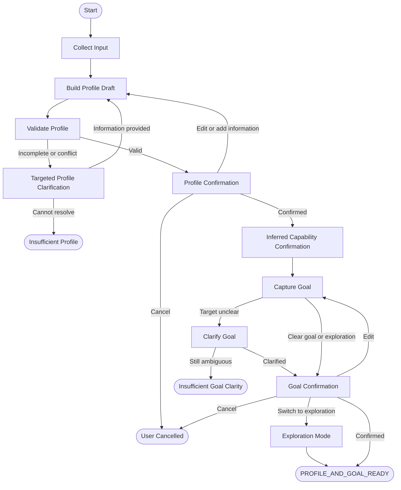

## Activity 5C Implemented Orchestration Boundary

The first executable LangGraph slice ends at `MARKET_READY`:

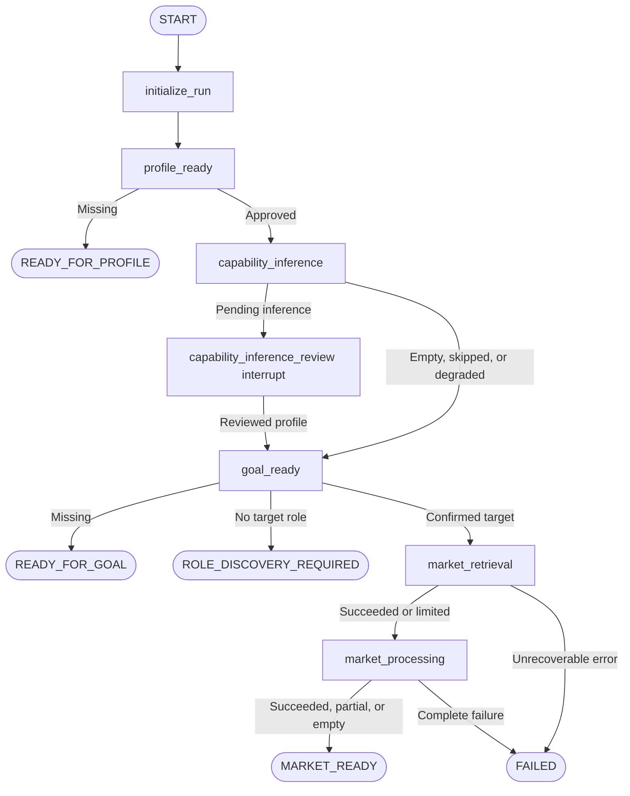

`capability_inference_review` uses a dynamic LangGraph interrupt and resumes with a reviewed
`CandidateProfile`. Code before the interrupt has no side effects, so the preceding inference call
is not repeated. Missing profile, missing goal, and no-target role discovery return control through
explicit terminal statuses because their forms remain outside the graph in Activity 5C.

Nodes receive `ModelGateway`, market-client construction, service callables, `Settings`, logging,
clock, and transient raw-content storage through `WorkflowRuntimeContext`. They do not store these
dependencies in checkpoint state. Existing services retain all capability-inference, search,
segmentation, validation, extraction, and aggregation business logic. Service-level bounded retries
remain authoritative; the graph records exhausted attempts but does not stack another retry loop.

The graph is compiled with an in-memory checkpoint saver for the current foundation. `thread_id`
selects checkpoint history and `run_id` identifies one analysis attempt. SQLite business storage,
durable production checkpointing, candidate comparison, gaps, accessibility, bridges, timelines,
plans, historical analysis, and mem0 remain outside Activity 5C.

## Activity 6A Candidate Comparison Extension

The executable V1 slice now continues from market readiness into one coarse career-analysis node:


The node delegates all comparison behavior to the career comparison service. That service admits
only approved explicit or confirmed-inference evidence, evaluates deterministic matches first,
and uses `ModelRole.REASONING` only for bounded semantic transferability. Posting-level
requirements retain exact-target or combined-related scope. Invalid evidence references and
individual model failures become typed limitations rather than invented matches. Gap generation,
candidate accessibility, bridge analysis, timeline assessment, and planning are not part of this
node.

## Activity 6B Gap and Accessibility Extension


The new node delegates to a deterministic policy service. Posting-level comparisons remain intact,
while user-facing gaps are consolidated by normalized capability and category with all contributing
requirement IDs retained. Exact-target requirements drive primary severity and accessibility;
related-only differences are advisory and cannot become `HIGH` solely from related-title volume.
Candidate accessibility is explained through gap severity, blockers, supported exact-target
requirements, and evidence sufficiency. It is not derived from market availability and has no
percentage score. The graph stops before bridge and timeline analysis.

## Activity 6C Bridge and Timeline Extension

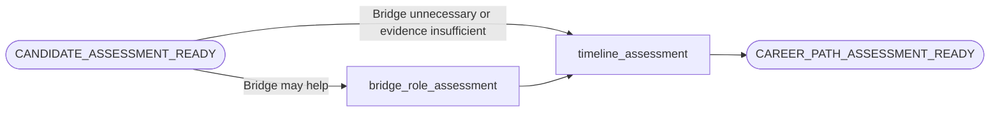

Bridge candidates are limited to titles already observed in retained related-title evidence. A
candidate must reduce at least one material gap and retains the exact reduced gap IDs. Apply-ready
candidates bypass substantive bridge evaluation; unwilling users receive no primary bridge
recommendation. Timeline classification uses accessibility, material gaps, blockers, bridge value,
the requested timeline, and user constraints. Missing timelines and unsupported prerequisite
durations return `UNSUPPORTED_INSUFFICIENT_EVIDENCE`. No CareerPlan or roadmap node is active.

## Activity 7A Career Plan Extension


The plan node delegates to a path-aware planning service. It maps bridge and accessibility
conclusions to an existing `PathType`, creates only milestones supported by gaps, bridge evidence,
timeline prerequisites, or the confirmed goal, and validates every gap and dependency reference.
Month ranges remain within the requested timeline; a missing timeline is preserved rather than
replaced with a default. The generated plan is version 1 with `DRAFT` plan and approval status.
Optional reasoning-model wording is input-minimized and strictly validated; failure retains the
deterministic draft with a limitation. The workflow stops before human plan approval or saving.

## Activity 7B Final Plan Review Extension

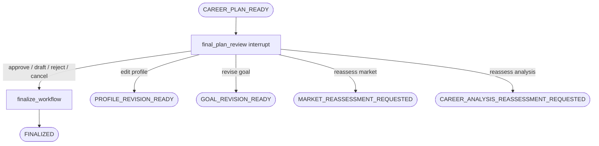

The interrupt exposes safe metadata and requires a typed action bound to the exact plan ID and
version in the checkpoint. The controller rejects stale submissions and returns the existing
result for a repeated identical terminal action. Approval produces an approved plan copy and uses
`COMPLETED_WITH_LIMITATIONS` when meaningful upstream limitations remain. Revision routing applies
one centralized invalidation policy and stops in an explicit handoff state; it does not
automatically rerun providers. All action records and draft-saving semantics are checkpoint/session
scoped until business persistence is implemented.

### Student Example

Profile evidence:

- Computer Science student
- Python coursework
- Two projects
- Hackathon participation
- Part-time customer-service work
- No professional technology employment

Conceptual interpretation:

- Python coursework → Exposure
- Python project → Demonstrated
- Hackathon teamwork → Possible inferred collaboration capability requiring confirmation
- Customer service → Possible communication or customer-facing transferable capability requiring confirmation

The workflow must not describe this user as an experienced software engineer.

### Senior Professional Example

Profile evidence:

- Senior UiPath Developer
- Enterprise automation delivery
- API integration
- Production support
- Stakeholder collaboration

Possible evidence-backed inferences include automation orchestration, enterprise integration, production operations, and cross-functional collaboration. These remain inferences until appropriately confirmed.

The interpreted goal is:

```text
Target: AI Solutions Architect
Timeline: 24 months
```

The goal must be shown to and confirmed by the user before Market Intelligence begins.

## Current Market Search Workflow

This workflow discovers and validates current market opportunities. It uses current market evidence and does not design historical-market analysis or requirement-stringency scoring. Historical market evidence, when available, is deferred to a later workflow.

### 1. Build Search Plan

Build the search plan from the user's confirmed target role, when one exists; current role; career stage; location; seniority; work-mode preference; industry preference; open-exploration mode; and search-expansion permission.

The plan distinguishes:

- Exact-title queries
- Related-title queries
- Role-family queries

The final search-plan schema is not defined yet.

### 2. Search Exact Titles

Search exact-title opportunities first when the user provides a specific target role. For example, a Product Owner search may use “Product Owner” with Toronto / Canada.

Conceptually record:

- Query
- Search date
- Geography
- Result count returned by the search source
- Source references

The returned result count is not the total number of jobs in the market.

### 3. Determine Whether Exact-Title Evidence Is Sufficient

Make the conceptual decision `EXACT_TITLE_EVIDENCE_SUFFICIENT` or `EXACT_TITLE_EVIDENCE_WEAK`. No numeric threshold is defined yet.

Evidence may be considered weak when:

- Too few relevant results are returned
- Results are mostly duplicates
- Results are stale
- Results are unrelated
- Results come from too few employers
- Title usage appears inconsistent

### 4. Search Related Titles

When exact-title evidence is weak, expand to related-title search candidates. Related titles must not automatically be treated as equivalent roles.

For Product Owner, candidates may include Technical Product Owner, Digital Product Owner, Platform Product Owner, and Business Product Owner. For Senior UiPath Developer, candidates may include Senior RPA Developer, Intelligent Automation Engineer, Automation Platform Engineer, and RPA Technical Lead.

### 5. Validate Search Results

Conceptually validate whether each result:

- Appears to be a job posting
- Matches the intended role family
- Identifies the employer
- Has a relevant location
- Is reasonably current
- Is likely still active
- Has an accessible source
- Is an aggregator, ATS page, or employer page

Prefer employer or ATS pages when available.

### 6. Deduplicate Postings

Conceptually deduplicate using available signals such as employer, original title, location, requisition ID, canonical URL, posting date, and content similarity. The final algorithm is not defined yet.

A duplicated posting must not inflate market counts.

### 7. Select Pages for Retrieval

Do not retrieve every search result automatically. Select a manageable and representative set, preferring employer pages, ATS pages, recent postings, diverse employers and locations where relevant, relevant seniority, and non-duplicate results. Final sample-size rules are deferred.

### 8. Retrieve Job-Page Content

The current intended path is LangGraph → Market Intelligence Service → MCP Client Layer → You.com MCP. The expected future content capability is `you-contents`. MCP tool schemas are not defined here.

### 9. Validate Retrieved Job Pages

Possible outcomes are:

- `VALID_POSTING`
- `EXPIRED_POSTING`
- `BLOCKED_PAGE`
- `INCOMPLETE_PAGE`
- `NON_JOB_CONTENT`
- `DUPLICATE_CONTENT`

The workflow must not fabricate missing content.

### 10. Normalize Titles

Preserve the original employer title while also recording an analytical normalized title and role family. For example, “Senior Intelligent Automation Developer” may be analyzed as “Senior Automation Engineer” within the “Intelligent Automation” role family. The original title must remain visible, and the final role-family taxonomy is deferred.

### 11. Build Current Market Snapshot

Conceptually record:

- Search date and geography
- Exact-title, related-title, and role-family queries
- Exact-title postings found
- Related-title postings found
- Unique validated postings
- Distinct employers
- Locations represented
- Work modes when available
- Sources
- Retrieval limitations
- Evidence-confidence level

The report must say: “We found X unique validated postings through the searched sources as of [date].” It must not say: “There are exactly X jobs in the market.”

### 12. Current Market Evidence Status

Possible outcomes are:

- `CURRENT_MARKET_EVIDENCE_SUFFICIENT`
- `CURRENT_MARKET_EVIDENCE_PARTIAL`
- `CURRENT_MARKET_EVIDENCE_INSUFFICIENT`

Partial or insufficient evidence may result from too few validated postings, too many blocked pages, narrow search coverage, excessive duplication, very stale postings, or fragmented role titles. Numeric thresholds are not defined yet.

### 13. Search Expansion

If evidence remains weak, the workflow may:

1. Search related titles.
2. Broaden the freshness window.
3. Broaden geography only when the user has granted permission.
4. Search role-family terms.

Geography must not be expanded silently. If evidence remains insufficient, return an insufficient-evidence result without inventing conclusions.

### Current Market Search Diagram

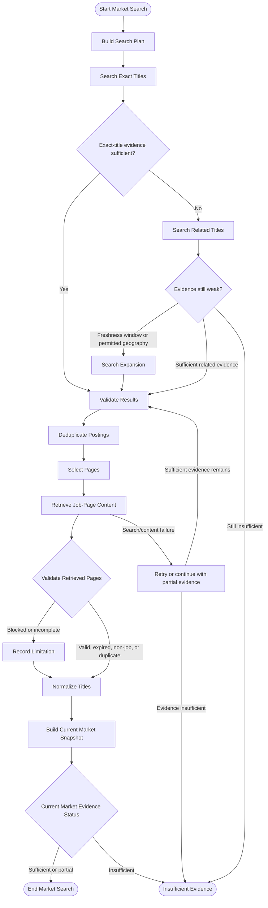

### Product Owner Example

For “What is the Product Owner market looking like right now?” the exact title is Product Owner. Related-title candidates include Technical Product Owner, Digital Product Owner, and Platform Product Owner.

Exact and related counts remain separate. Duplicates are removed, employer and ATS pages are preferred, and the final count reflects only validated results found through the searched sources. No real count is assumed or invented.

### Senior UiPath Developer Example

For “I am a Senior UiPath Developer. What opportunities are available right now?” the exact title is Senior UiPath Developer. Related-title candidates include Senior RPA Developer, Intelligent Automation Engineer, Automation Platform Engineer, and RPA Technical Lead.

A weak exact-title market does not necessarily mean the broader transferable-skill market is weak. This workflow describes current market evidence only; candidate-fit analysis is deferred to the Career Analysis stage.

## Requirement Stringency Workflow

This workflow determines how demanding or restrictive employer requirements are across validated current job postings. Requirement stringency is a market characteristic, not a candidate-fit score. It remains separate from candidate accessibility, historical demand, the number of openings, and market competition.

### 1. Purpose

The workflow answers: “How demanding or restrictive are the qualifications employers are asking for?” A role may have many openings and high stringency, or few openings and low stringency.

### 2. Input

Use only validated current job postings produced by the Current Market Search workflow. Do not use candidate-profile information.

Potential requirement evidence includes required or preferred years of experience, domain and technology experience, education, certifications, licences, security clearance, work authorization, languages, people management, budget, portfolio, product or architecture ownership, industry-specific requirements, geographic requirements, and other mandatory prerequisites.

### 3. Extract Requirements

Conceptually classify requirements as:

- `TECHNICAL`
- `DOMAIN`
- `EXPERIENCE`
- `EDUCATION`
- `CREDENTIAL`
- `LEADERSHIP`
- `SCOPE`
- `COMMUNICATION`
- `LOCATION`
- `WORK_AUTHORIZATION`
- `LANGUAGE`
- `OTHER`

For each requirement, conceptually retain its text, category, mandatory or preferred status, stated years, frequency within the validated sample, evidence source, and extraction confidence. The final schema is not defined yet.

### 4. Mandatory versus Preferred

Mandatory requirements include statements such as “5+ years required,” “must hold Secret clearance,” or “requires Canadian work authorization.” Preferred requirements include “Azure is preferred,” “PMP is an asset,” or “financial-services knowledge is desirable.” Preferred requirements must not be treated as hard barriers.

### 5. Frequency within the Validated Sample

Describe how often requirements occur only within the validated posting sample. Conceptual descriptions include common mandatory, common preferred, occasional, and rare requirements. No population-wide frequency or numeric cutoff is implied.

### 6. Hard-Barrier Signals

Signals that may materially restrict entry include extensive role-specific experience, mandatory licences, security clearance, industry experience, people management, portfolio or budget ownership, degrees, location or work authorization, and language capability.

One hard requirement does not automatically force a `HIGH` classification. The pattern across validated postings must be considered.

### 7. Experience Stringency

Analyze separately:

- Entry-level / 0–2 years
- 3–5 years
- 5–8 years
- 8+ years
- Prior exact-role experience
- Prior adjacent-role experience
- Prior leadership or management experience

Do not define thresholds beyond what postings explicitly state.

### 8. Specialization Stringency

Determine whether employers request broad transferable capabilities or narrow role-specific and industry-specific experience. For example, “experience delivering digital products” is broad, while “5 years of Product Ownership experience in Canadian retail banking” is narrow. Narrow mandatory specialization contributes more strongly to stringency analysis.

### 9. Requirement Consistency

Classify consistency independently from overall stringency:

- `CONSISTENT`
- `MIXED`
- `HIGHLY_VARIABLE`
- `INSUFFICIENT_EVIDENCE`

Repeated requirements such as backlog ownership and stakeholder management may indicate stable expectations within the validated sample. Wide variation may indicate a less standardized role. Numeric thresholds are not defined.

### 10. Stringency Classification

Possible classifications are:

- `LOW`
- `MODERATE`
- `HIGH`
- `INSUFFICIENT_EVIDENCE`

Every classification must include reasons. For example, a `HIGH` result could cite repeated mandatory prior Product Owner experience, several postings requiring five or more years, recurring domain specialization, and roadmap ownership. The workflow must not output an unexplained score or percentage.

### 11. Confidence

Use `HIGH`, `MODERATE`, `LOW`, or `INSUFFICIENT`. Confidence depends conceptually on the number and diversity of validated postings, posting completeness, extraction quality, requirement consistency, and search coverage. Numeric thresholds are not defined.

### 12. Insufficient Evidence

Return `INSUFFICIENT_EVIDENCE` rather than forcing `LOW`, `MODERATE`, or `HIGH` when too few validated postings exist, too many are incomplete, requirements cannot be extracted reliably, one employer dominates the sample, or role titles are too fragmented. Do not fabricate a stringency conclusion.

### 13. Product Owner Example

Across validated Product Owner postings, the workflow may find backlog ownership, stakeholder management, product lifecycle experience, and prior Product Owner or Product Manager experience. It evaluates whether each is mandatory or preferred, common or occasional within the sample, and broadly transferable or role-specific, then explains the resulting classification without inventing percentages.

### 14. Senior UiPath / RPA Example

Across validated Senior UiPath Developer or related RPA postings, possible requirements include UiPath, Orchestrator, RPA delivery, APIs, Power Platform, Python, production support, and architecture experience. The workflow distinguishes UiPath-specific mandatory requirements, general automation capabilities, preferred adjacent technologies, and stated seniority expectations. It does not perform candidate-fit analysis.

### Requirement Stringency Diagram

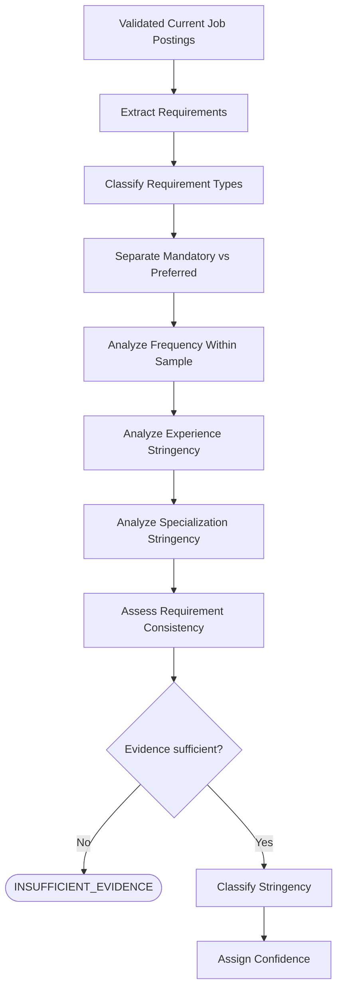

## Market Verdict Workflow

This workflow synthesizes market-side evidence into an explainable assessment of what the market currently and historically looks like for a role or role family. It uses only market evidence and remains separate from candidate fit, candidate accessibility, transferable skills, candidate gaps, and career-path recommendations.

### 1. Purpose

The Market Verdict answers: “What does the market currently and historically look like for this role or role family?” The same verdict may apply to multiple users, while candidate accessibility may differ for each user.

### 2. Inputs

Use market-side evidence only:

- **Current Market Snapshot:** Exact-title and related-title validated postings, unique validated postings, distinct employers, geography, work-mode distribution, freshness, evidence confidence, and search limitations.
- **Historical Market Signal, when available:** Persistence, trend, seasonality, employer concentration, historical confidence, role scope, and historical limitations.
- **Requirement Stringency:** `LOW`, `MODERATE`, `HIGH`, or `INSUFFICIENT_EVIDENCE`.
- **Requirement Consistency:** `CONSISTENT`, `MIXED`, `HIGHLY_VARIABLE`, or `INSUFFICIENT_EVIDENCE`.

Candidate-profile information must not be used.

### 3. Market Dimensions

Evaluate these dimensions separately and keep them visible in the explanation.

#### Current Availability

Possible classifications:

- `BROAD`
- `MODERATE`
- `NICHE`
- `INSUFFICIENT_EVIDENCE`

Consider validated posting volume, distinct employers, geographic spread, related-title breadth, and search coverage. Numeric thresholds remain undefined.

#### Historical Persistence

Use `PERSISTENT`, `FREQUENT`, `INTERMITTENT`, `SEASONAL`, `SPARSE`, or `INSUFFICIENT_EVIDENCE`.

#### Trend

Use `RISING`, `STABLE`, `DECLINING`, `VOLATILE`, `UNCLEAR`, or `INSUFFICIENT_EVIDENCE`.

#### Seasonality

Use `NON_SEASONAL`, `MILD_SEASONALITY`, `STRONG_SEASONALITY`, `UNCLEAR`, or `INSUFFICIENT_EVIDENCE`.

#### Employer Concentration

Use `DIVERSE`, `MODERATELY_CONCENTRATED`, `HIGHLY_CONCENTRATED`, or `UNKNOWN`.

#### Requirement Stringency

Use `LOW`, `MODERATE`, `HIGH`, or `INSUFFICIENT_EVIDENCE`. It informs the explanation but does not determine market breadth.

#### Requirement Consistency

Keep the independently assessed `CONSISTENT`, `MIXED`, `HIGHLY_VARIABLE`, or `INSUFFICIENT_EVIDENCE` classification visible.

### 4. Market Verdict Categories

Use these categories:

- `BROAD_AND_PERSISTENT`
- `BROAD_BUT_VOLATILE`
- `NICHE_BUT_STABLE`
- `NICHE_AND_DECLINING`
- `EMERGING`
- `SEASONAL`
- `INSUFFICIENT_EVIDENCE`

Every verdict includes supporting reasons. No single unexplained numerical score is produced.

### 5. Verdict Interpretation

- **`BROAD_AND_PERSISTENT`:** Meaningful current availability, multiple employers or locations, consistent historical activity, and no evidence that current demand is merely a temporary spike.
- **`BROAD_BUT_VOLATILE`:** Meaningful availability with substantial variation over time.
- **`NICHE_BUT_STABLE`:** A smaller market with consistent opportunities and no clear decline.
- **`NICHE_AND_DECLINING`:** A relatively limited market with historical evidence suggesting declining activity.
- **`EMERGING`:** Growing or newly appearing activity, potentially fragmented titles, and limited long-term history. Missing historical data alone is not enough.
- **`SEASONAL`:** Credible recurring concentration in particular periods.
- **`INSUFFICIENT_EVIDENCE`:** Evidence does not support a credible market verdict.

### 6. Role-Scope Disclosure

The verdict must disclose whether it is supported by exact-title, exact-plus-related-title, normalized role-family, or broader occupational-family evidence. For example, current analysis may use Product Owner plus related titles while the historical signal uses the broader Product Management role family. This difference must be explicit.

### 7. Current versus Historical Conflict

Conflicting signals must be explained rather than averaged away:

- Strong current market with declining historical trend may indicate a short-term rebound or localized hiring period and must not automatically become `BROAD_AND_PERSISTENT`.
- Weak current market with persistent and stable historical activity may indicate a temporary slowdown.
- Strong current market with unavailable historical evidence must not be treated as persistent; the result may remain `INSUFFICIENT_EVIDENCE` or provide a current-market description only.

Missing historical evidence is never converted into persistence.

### Evidence Sufficiency Distinction

The workflow distinguishes between evidence sufficient for a current-market summary and evidence sufficient for a full market verdict requiring historical support.

If current market evidence is strong but historical evidence is unavailable, the system may still report:

- Current Availability
- Distinct Employers
- Geography
- Requirement Stringency
- Requirement Consistency
- Current-market confidence

However, it must not assign a verdict that implies historical persistence, such as `BROAD_AND_PERSISTENT`. In this case:

- Historical Persistence = `INSUFFICIENT_EVIDENCE`
- Historical confidence = `INSUFFICIENT`
- The current-market description remains valid
- The explanation states clearly that long-term persistence cannot be determined

The approved market-verdict categories remain unchanged. Historical absence does not make a valid current-market summary unusable.

### 8. Requirement Stringency Relationship

Requirement Stringency informs the market explanation but does not determine market breadth. Broad availability with `HIGH` stringency means many opportunities have restrictive qualifications. Niche availability with `LOW` stringency means fewer opportunities have relatively less restrictive qualifications. These dimensions are not collapsed into one score.

### 9. Confidence

Use `HIGH`, `MODERATE`, `LOW`, or `INSUFFICIENT`. Confidence depends conceptually on current search coverage, validated-source count, employer diversity, historical coverage, role-scope match, freshness, completeness, exact-title versus broader-family substitution, and agreement or conflict between current and historical evidence. Numeric thresholds remain undefined.

### 10. Final Market Summary

Conceptually produce:

- Role or role family
- Geography
- Current availability
- Historical persistence
- Trend
- Seasonality
- Employer concentration
- Requirement stringency
- Requirement consistency
- Market verdict
- Confidence
- Supporting reasons
- Data limitations
- Source scope

The final schema is not defined yet.

### 11. Product Owner Example

If current Product Owner and related-title postings span multiple employers and historical Product Management activity is observed across much of the year with a stable trend and moderate stringency, `BROAD_AND_PERSISTENT` may be possible only if the evidence supports it. The explanation must identify the evidence, disclose whether history is exact-title or broader role-family, and state limitations. No real counts are invented.

### 12. Senior UiPath / RPA Example

If exact Senior UiPath Developer postings are limited but broader RPA or Intelligent Automation roles exist, historical role-family evidence is stable, and demand is spread across several organizations, `NICHE_BUT_STABLE` may be possible only if supported. A weak exact-title market does not necessarily mean the broader role-family market is declining. Candidate-fit analysis is excluded.

### 13. Insufficient-Evidence Path

Return `INSUFFICIENT_EVIDENCE` when current evidence is too weak, required historical evidence is unavailable, role scope is ambiguous, exact-title and broader-family evidence conflict too strongly, sources are stale, employer coverage is too concentrated, or data quality is too weak. Observed market facts may still be displayed without forcing a verdict.

### 14. Market Verdict Diagram

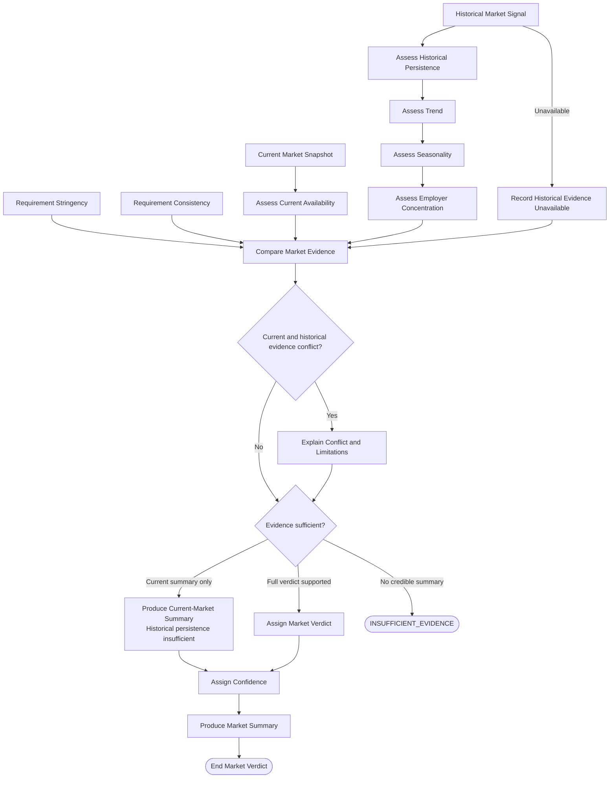

### 15. Market Verdict Must Not

Market Verdict must not:

- Use candidate skills, resume quality, or seniority
- Predict whether a candidate will be hired
- Estimate job-offer probability
- Guarantee market outcomes
- Hide role-family substitutions
- Infer persistence from current postings alone
- Perform candidate accessibility, transferable-skill, gap, or bridge-role analysis

## Candidate-to-Role Comparison and Transferable Skills Workflow

This workflow compares confirmed candidate evidence with role requirements one requirement at a time. It identifies direct matches, transferable matches, partial matches, no confirmed matches, and remaining differences without assigning final role accessibility.

### 1. Purpose

The workflow answers: “What capabilities does this person already have that directly or indirectly support this role?” It must distinguish direct matches, transferable matches, partial matches, unsupported or unconfirmed capabilities, and missing capabilities.

Final role accessibility, role classifications, bridge-role ranking, and timeline feasibility are deferred.

### 2. Inputs

Use:

- **Confirmed Candidate Profile:** Confirmed employment, education, projects, internships, evidence items, approved inferred capabilities, evidence maturity, and leadership/scope evidence.
- **Role Requirements:** Technical, domain, experience, education, credential, leadership, scope, communication, location, work authorization, language, and other requirements.
- **Market Requirement Context:** Mandatory versus preferred status, requirement frequency, requirement consistency, and requirement stringency.

Unconfirmed or rejected candidate inferences must not be treated as established facts.

### 3. Direct Match

A `DIRECT_MATCH` means the candidate has confirmed evidence of the relevant capability at a maturity, scale, and scope that credibly satisfies the requirement. For example, a role requiring UiPath Orchestrator and confirmed evidence of using UiPath Orchestrator in production automation delivery at the relevant scale supports a direct match. Evidence references and maturity remain visible.

### 4. Transferable Match

A `TRANSFERABLE_MATCH` means the exact experience differs, but confirmed evidence supports an underlying capability that plausibly transfers. For example, confirmed REST integrations between UiPath and enterprise applications may support the transferable capability of enterprise API integration for a role requiring API integration in AI solutions.

The explanation must state what transfers, why it is relevant, what remains missing, and the confidence. Transferability must be evidence-supported, not inferred from similar titles alone.

### 5. Partial Match

A `PARTIAL_MATCH` means relevant confirmed evidence exists, but maturity, scale, domain, scope, or completeness does not fully satisfy the requirement. Two Python portfolio projects may partially match production Python engineering because demonstrated project evidence exists but production experience is not confirmed.

### 6. No Confirmed Match

Use `NO_CONFIRMED_MATCH` when no confirmed evidence supports the requirement. Unconfirmed or rejected inferences must also route to `NO_CONFIRMED_MATCH`; they must not be treated as candidate facts. Absence of evidence must not be converted into evidence of absence.

### 7. Evidence Maturity Comparison

Compare the approved levels `EXPOSURE`, `DEMONSTRATED`, `APPLIED`, `PRODUCTION`, and `LEADERSHIP`. If a role expects Production and the candidate has Demonstrated evidence, the result is a `PARTIAL_MATCH` and the maturity gap is preserved for later gap analysis. Maturity must not be raised without evidence.

### 8. Transferability Dimensions

Conceptually assess transferability across:

- Technical capability
- Problem-solving pattern
- Domain adjacency
- Process knowledge
- Integration experience
- Platform experience
- Stakeholder interaction
- Delivery ownership
- Production operations
- Architecture or design
- Leadership or scope

No numeric transferability score is defined.

### 9. Transferability Confidence

Use `HIGH`, `MODERATE`, `LOW`, or `INSUFFICIENT`. Confidence depends on candidate-evidence strength, evidence maturity, similarity of the underlying capability, domain difference, scale difference, seniority difference, requirement clarity, and the number of supporting evidence items. Do not produce unexplained percentages.

### 10. Requirement-by-Requirement Comparison

For each important requirement, conceptually record:

- Requirement
- Mandatory or preferred status
- Candidate evidence
- Candidate maturity
- Match type
- Transferable capability
- Remaining difference
- Confidence
- Evidence references

The final comparison schema is not defined yet.

### 11. Student Example

Candidate evidence includes Python coursework, two Python projects, a hackathon, and customer-service experience. For a Junior Data Analyst role:

- Python → `DIRECT_MATCH` or `PARTIAL_MATCH`, depending on the role's required maturity
- Communication → possible `TRANSFERABLE_MATCH` from customer-service evidence if confirmed
- SQL → `NO_CONFIRMED_MATCH` if no evidence exists
- Data visualization → `NO_CONFIRMED_MATCH` if no evidence exists

The student must not be described as having professional Python experience.

### 12. Senior UiPath to Product Owner Example

Candidate evidence includes automation delivery, requirements discussions, stakeholder collaboration, and production ownership. Product Owner requirements may include stakeholder management, backlog ownership, product roadmap, prioritization, and product lifecycle ownership.

- Stakeholder management → `DIRECT_MATCH` if confirmed
- Technical delivery ownership → potential `TRANSFERABLE_MATCH`
- Backlog ownership → `NO_CONFIRMED_MATCH` unless evidence exists
- Product roadmap → `NO_CONFIRMED_MATCH` unless evidence exists

Technical delivery does not automatically equal Product Ownership.

### 13. Senior UiPath to AI Solutions Architect Example

Candidate evidence includes enterprise automation, REST APIs, production support, solution design, and stakeholder collaboration. Target requirements may include API architecture, AI solution design, RAG, cloud AI platforms, production LLM delivery, and architecture ownership.

- API integration → `DIRECT_MATCH` or `TRANSFERABLE_MATCH`
- Solution design → `TRANSFERABLE_MATCH` depending on confirmed scope
- RAG → `NO_CONFIRMED_MATCH` unless evidence exists
- Production LLM delivery → `NO_CONFIRMED_MATCH` unless evidence exists
- Architecture ownership → `PARTIAL_MATCH` if solution-design evidence exists but accountability is not confirmed

### 14. Must Not

The workflow must not:

- Invent candidate experience
- Treat unconfirmed inference as fact
- Treat coursework as production experience
- Treat similar titles as proof of capability
- Convert transferable skills into direct experience
- Assume leadership from a senior technical title
- Assume domain knowledge from an employer name alone
- Use protected personal attributes
- Assign final role accessibility
- Classify roles as direct, adjacent, bridge, aspirational, or poor fit
- Rank bridge roles or assess timeline feasibility

### Candidate-to-Role Comparison Diagram

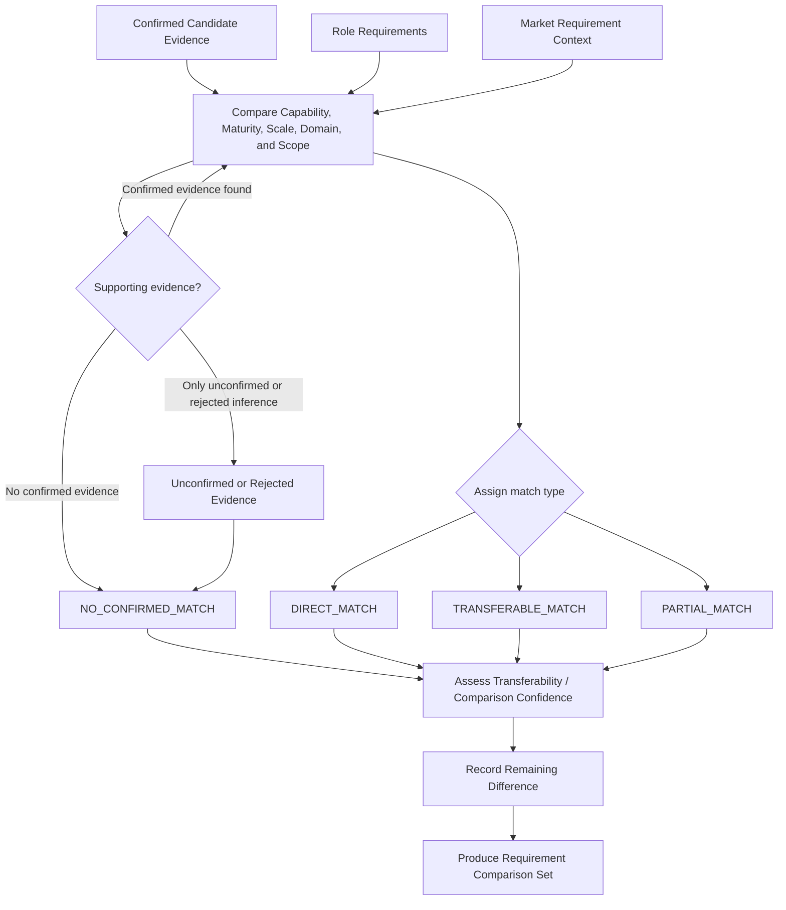

## Gap Classification and Candidate Accessibility Workflow

This workflow converts remaining differences from the Requirement Comparison Set into meaningful gap categories and assesses candidate accessibility for one role. Candidate Accessibility is a person-plus-role conclusion and remains separate from the Market Verdict.

### 1. Purpose

The workflow answers:

1. What prevents this candidate from fully satisfying the role?
2. Which gaps are meaningful, optional, or hard blockers?
3. How targetable is this role for this candidate today?

For example, a role may have a `BROAD_AND_PERSISTENT` Market Verdict while the candidate's accessibility is `NEAR_TERM_TARGET`. These are different conclusions.

### 2. Inputs

Use:

- **Requirement Comparison Set:** Requirement, mandatory or preferred status, candidate evidence, candidate maturity, match type, transferable capability, remaining difference, confidence, and evidence references.
- **Market Requirement Context:** Requirement frequency, consistency, stringency, and mandatory-versus-preferred status.
- **Confirmed Candidate Profile:** Confirmed evidence or approved inferred capabilities only.

Rejected or unconfirmed inferences must not be used as evidence.

### 3. Gap Categories

Use exactly these five primary categories:

1. **`SKILL`:** The candidate lacks knowledge or technical or business capability required by the role.
2. **`EXPERIENCE`:** The candidate may understand the capability but lacks sufficient applied, production, domain, scale, or role-specific experience.
3. **`LEADERSHIP_SCOPE`:** The target requires broader ownership or authority than the candidate has demonstrated, such as people, budget, portfolio, architecture accountability, strategy, executive influence, vendors, or geographic or enterprise scope.
4. **`EVIDENCE`:** The candidate may possess the capability, but credible proof is missing or weak.
5. **`CREDENTIAL_PREREQUISITE`:** A formal or mandatory prerequisite is missing or unconfirmed, such as a degree, licence, certification, clearance, work authorization, language, or location condition.

No extra gap categories are created in this activity.

### 4. Skill versus Experience

A skill gap means, “I do not yet know how to do this.” An experience gap means, “I may know how to do this, but I have not demonstrated applying it at the required level.”

For example, an LLM/RAG course may partially support a skill requirement, while production RAG delivery remains an experience gap. The workflow must not recommend another course when the actual missing element is applied experience.

### 5. Experience versus Evidence

An experience gap means the experience itself is absent or below the required maturity. An evidence gap means the experience may exist, but the profile lacks sufficient proof. A confirmed statement about stakeholder management without meaningful examples may indicate an `EVIDENCE` gap; never owning stakeholder relationships may indicate an `EXPERIENCE` gap.

Missing profile evidence must not automatically be treated as missing experience.

### 6. Gap Origin

For each gap, conceptually retain the requirement, gap category, mandatory or preferred status, current candidate evidence, current maturity, target expectation, remaining difference, gap severity, hard-blocker status, evidence needed, possible future action, confidence, and source references. The final schema is not defined yet.

### 7. Gap Severity

Use:

- `LOW`
- `MODERATE`
- `HIGH`
- `BLOCKING`
- `INSUFFICIENT_EVIDENCE`

Severity considers mandatory versus preferred status, requirement frequency, maturity difference, difficulty of acquiring the capability, formal or legal requirements, consistency across postings, and whether transferable evidence reduces the gap. A missing keyword is not automatically `HIGH`. Numeric thresholds are not defined.

### 8. Hard Blockers

A hard blocker is a requirement that materially prevents immediate eligibility. Examples include an absent mandatory licence, unavailable mandatory security clearance, unconfirmed mandatory work authorization, absent legally required credential, unmet mandatory language requirement, or materially unmet explicit experience prerequisite.

Hard-blocker status must be explainable. Preferred requirements cannot become hard blockers. One hard blocker restricts immediate eligibility but does not mean the career is impossible.

### 9. Preferred Requirements

Preferred requirements influence readiness but generally should not prevent application. For example, “Azure certification is an asset” may produce a `CREDENTIAL_PREREQUISITE` gap with `LOW` severity, not a hard blocker.

### 10. Aggregate Role Readiness

After individual gaps are classified, evaluate the role as a whole using coverage of mandatory requirements, direct and transferable matches, number and severity of gaps, hard blockers, evidence maturity, requirement stringency and consistency, and comparison confidence. The result must remain explainable and must not be reduced to one opaque percentage.

### 11. Candidate Accessibility

Use these classifications:

- `APPLY_NOW`
- `APPLY_SELECTIVELY`
- `NEAR_TERM_TARGET`
- `ASPIRATIONAL`
- `POOR_FIT`
- `INSUFFICIENT_CANDIDATE_EVIDENCE`

`RECOMMENDED_BRIDGE` is deferred to Activity 2B-4C.

### 12. Accessibility Interpretation

- **`APPLY_NOW`:** Most important mandatory requirements are credibly supported, remaining gaps are minor or preferred, maturity is broadly appropriate, and no material hard blocker is present. This does not guarantee hiring.
- **`APPLY_SELECTIVELY`:** Meaningful direct or transferable alignment exists, but moderate gaps mean some employers or postings may be realistic while others are too restrictive.
- **`NEAR_TERM_TARGET`:** The role is plausible with focused gap closure, but meaningful gaps prevent strong immediate positioning and relevant evidence or experience may reasonably be built first.
- **`ASPIRATIONAL`:** Relevant foundation exists, but significant skill, experience, leadership/scope, or maturity gaps remain; the role is not currently a realistic immediate target.
- **`POOR_FIT`:** Important requirements have weak overlap and multiple severe or blocking gaps exist. This does not mean the user can never pursue the role.
- **`INSUFFICIENT_CANDIDATE_EVIDENCE`:** Candidate information is too incomplete or uncertain to classify accessibility credibly.

### 13. Role Category Relationship

Accessibility may later inform role categories, but this activity does not finalize them. Conceptually, `APPLY_NOW` often supports `DIRECT_FIT`; `APPLY_SELECTIVELY` may support `DIRECT_FIT` or `ADJACENT`; `NEAR_TERM_TARGET` may support `ADJACENT` or a future bridge candidate; `ASPIRATIONAL` often supports `ASPIRATIONAL`; and `POOR_FIT` often supports `POOR_FIT`. `BRIDGE` is not assigned here.

### 14. Market Stringency Relationship

Requirement Stringency may provide context but never replaces candidate evidence. The same candidate gaps may support `APPLY_SELECTIVELY` in a low-stringency market and `NEAR_TERM_TARGET` in a high-stringency market where requirements are consistently mandatory. These remain separate conclusions.

### 15. Student Example

A Computer Science student has Python coursework, two Python projects, customer-service experience, and no SQL evidence. For a Junior Data Analyst role, Python may be `PARTIAL_MATCH` or `DIRECT_MATCH` depending on required maturity; SQL is a `SKILL` gap; communication may be a `TRANSFERABLE_MATCH` if confirmed; and professional analytics experience may be an `EXPERIENCE` gap. Overall accessibility might be `NEAR_TERM_TARGET`, but `APPLY_NOW` requires supporting evidence.

### 16. UiPath to Product Owner Example

Confirmed enterprise automation delivery, stakeholder collaboration, requirements discussions, and production ownership may directly support stakeholder management. If backlog ownership and product-roadmap work are absent, they are `EXPERIENCE` gaps; product outcomes may be an `EVIDENCE` or `EXPERIENCE` gap. Accessibility may be `APPLY_SELECTIVELY` or `NEAR_TERM_TARGET`, depending on validated requirements and evidence. No single outcome is forced.

### 17. UiPath to AI Solutions Architect Example

Enterprise automation, REST APIs, production support, solution design, and stakeholder collaboration may support API integration directly or transferably. RAG and cloud AI may be `SKILL` or `EXPERIENCE` gaps, production LLM delivery is an `EXPERIENCE` gap, architecture ownership may be `LEADERSHIP_SCOPE` or `EXPERIENCE`, and an AI architecture portfolio may be an `EVIDENCE` gap. Accessibility may be `ASPIRATIONAL` or `NEAR_TERM_TARGET` based on actual evidence and requirements; the 24-month timeline is not assessed.

### 18. Senior Professional to Director Example

A senior individual contributor with some project leadership but no confirmed people management, budget ownership, or portfolio strategy evidence may have `LEADERSHIP_SCOPE` gaps for people management, budget, and portfolio strategy, plus `EVIDENCE` or `EXPERIENCE` gaps for executive outcomes. Accessibility may be `ASPIRATIONAL`; the two-year timeline is not assessed.

### 19. Insufficient Candidate Evidence

Return `INSUFFICIENT_CANDIDATE_EVIDENCE` when the profile is too incomplete, major evidence remains unconfirmed, critical comparisons cannot be made, or candidate evidence is too vague. Ask targeted clarification where useful before stopping.

### 20. Must Not

The workflow must not use protected attributes, invent experience, convert missing evidence into missing experience, treat preferred requirements as mandatory, recommend courses for every gap, guarantee hiring outcomes, estimate offer probability, assign a bridge role, assess a timeline, or use an unexplained numerical fit score.

### Gap Classification and Candidate Accessibility Diagram

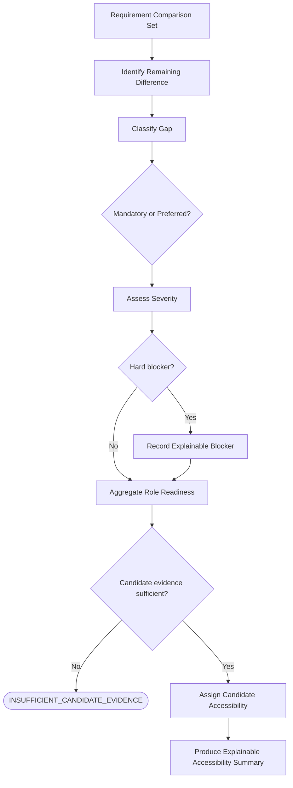

## Bridge Role and Timeline Analysis Workflow

This workflow determines whether a candidate needs an intermediate role, evaluates a small set of evidence-supported bridge options when needed, and assesses the feasibility of the requested timeline. It does not generate the final Career Plan or roadmap.

### 1. Purpose

The workflow answers:

- Does the candidate need an intermediate role?
- If so, which bridge role is useful and realistic?
- Is the requested target timeline realistic?
- What conditions would make that timeline more credible?

### 2. Inputs

Use candidate accessibility, classified gaps, gap severity, hard blockers, confirmed candidate evidence, current market evidence, credible historical market evidence when available, target role, requested timeline, bridge-role willingness, and user constraints. Do not use unconfirmed candidate facts.

### 3. Direct Path Decision

Conceptually decide between `DIRECT_PATH_CREDIBLE` and `BRIDGE_ROLE_EVALUATION_REQUIRED`.

A direct path may be credible when accessibility is `APPLY_NOW` or `APPLY_SELECTIVELY`, no material blocker exists, high-severity gaps are limited, maturity broadly matches expectations, and missing experience is not consistently mandatory across the market. Do not force a bridge role when direct targeting is credible.

### 4. Bridge Role Definition

A bridge role is an intermediate role that uses meaningful current strengths, is more accessible than the target, builds target capabilities, reduces multiple important gaps, creates stronger evidence or scope, exists credibly in the market, and fits the user's constraints. It is not simply the nearest title.

### 5. Bridge Role Candidates

Identify a small number of plausible candidates using adjacent role families, transferable capabilities, target gaps, market availability, candidate accessibility, and role-family relationships. Do not generate large generic lists.

### 6. Bridge Evaluation Dimensions

Evaluate each candidate across:

- Current strength overlap
- Gap reduction
- Target capability gain
- Market availability
- Candidate accessibility
- Evidence building
- Leadership or scope gain
- User constraint fit

For leadership transitions, consider people leadership, budget ownership, portfolio ownership, strategy, architecture accountability, executive influence, and vendor responsibility.

### 7. Bridge Outcomes

Use:

- `NO_BRIDGE_REQUIRED`
- `RECOMMENDED_BRIDGE`
- `MULTIPLE_PLAUSIBLE_BRIDGES`
- `NO_VALID_BRIDGE_ROLE`
- `INSUFFICIENT_EVIDENCE`

Do not force a recommendation when evidence is weak.

### 8. Bridge Explanation

For each credible bridge candidate, conceptually retain the role, current-strength transfer, target gaps reduced, capabilities built, market availability, candidate accessibility, risks, tradeoffs, and confidence. Do not create an opaque numeric score.

### 9. Timeline Feasibility

Assess the requested timeline using current accessibility, gap count and severity, hard blockers, required evidence maturity, experience gaps, leadership/scope gaps, evidence-building requirements, bridge-role requirement, bridge and target availability, and user constraints. Timeline feasibility is an assessment, not a guarantee.

### 10. Timeline Classifications

Use:

- `REALISTIC`
- `AGGRESSIVE_BUT_PLAUSIBLE`
- `UNLIKELY_WITHOUT_INTERMEDIATE_ROLE`
- `UNSUPPORTED_INSUFFICIENT_EVIDENCE`

Every result includes reasons. Numeric thresholds are not defined.

### 11. Timeline Output

Every assessment conceptually includes the requested timeline, classification, assumptions, major blocking gaps, required milestones, whether a bridge is required, market dependencies, confidence, and evidence limitations. The final roadmap is deferred.

### 12. UiPath to AI Solutions Architect Example

A Senior UiPath Developer with enterprise automation, REST APIs, production support, solution design, and stakeholder collaboration may have gaps in RAG, cloud AI, production LLM delivery, architecture ownership, and AI solution evidence. Possible bridge candidates include AI Automation Engineer, GenAI Solutions Engineer, and AI Platform Engineer.

Evaluate which candidates use existing strengths, build AI delivery experience, build architecture credibility, exist in the market, and are realistically accessible. Do not force a winner. A possible timeline classification may be `AGGRESSIVE_BUT_PLAUSIBLE` or `UNLIKELY_WITHOUT_INTERMEDIATE_ROLE` depending on evidence.

### 13. UiPath to Product Owner Example

A Senior UiPath Developer with requirements discussions, stakeholder collaboration, and production ownership may consider Technical Product Owner as a possible bridge. First determine whether a bridge is required. Valid outcomes include `NO_BRIDGE_REQUIRED`, `RECOMMENDED_BRIDGE`, or `MULTIPLE_PLAUSIBLE_BRIDGES`; Technical Product Owner is not always required.

### 14. Senior Professional to Director Example

A senior individual contributor with project leadership, limited people management, no confirmed budget ownership, and limited portfolio strategy may evaluate Manager, Senior Manager, Technical Lead with expanded responsibility, or Head-of-Function roles in a smaller organization. Evaluate actual scope gain rather than title alone. Possible timeline classifications are `AGGRESSIVE_BUT_PLAUSIBLE` or `UNLIKELY_WITHOUT_INTERMEDIATE_ROLE`, depending on evidence.

### 15. Student to AI Engineer Example

A Computer Science student with Python coursework, projects, and no production AI experience may consider an AI/ML internship, Junior Python Developer, Junior Data Analyst, or Junior AI Automation role. Prefer entry points that build production evidence; do not treat coursework as production experience.

### 16. No Valid Bridge Role

Return `NO_VALID_BRIDGE_ROLE` when candidate strengths do not align with plausible intermediates, market evidence is weak, proposed roles do not materially reduce target gaps, or user constraints eliminate realistic options. Do not fabricate a bridge role.

### 17. Multiple Bridge Roles

When multiple bridge roles are credible, present tradeoffs rather than forcing one winner. For example, AI Automation Engineer may offer stronger current-skill overlap and AI delivery exposure, while GenAI Solutions Engineer may offer stronger customer and architecture exposure but require stronger GenAI evidence.

### 18. Confidence

Use `HIGH`, `MODERATE`, `LOW`, or `INSUFFICIENT`. Bridge confidence and timeline confidence remain separate. Neither is represented as an unexplained percentage.

### 19. Must Not

The workflow must not guarantee career outcomes or promotions, predict exact hiring probability, treat certification as equivalent to experience, assume a bridge automatically leads to the target, use protected personal attributes, force a bridge, or force a timeline conclusion when evidence is insufficient.

### Bridge Role and Timeline Analysis Diagram

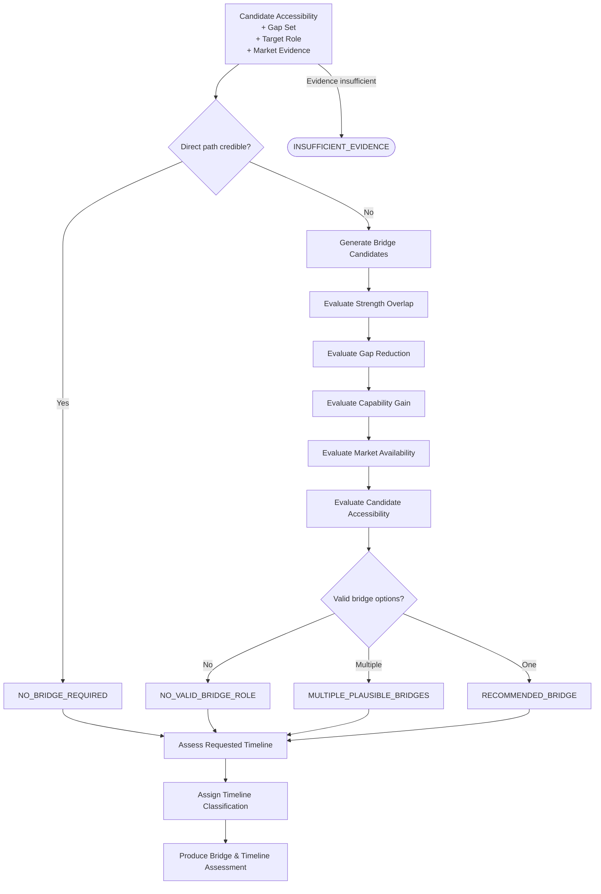

## Career Plan Assembly and Roadmap Workflow

This workflow turns validated analysis into a draft Career Strategy Plan that explains what the user should do next, in what order, and why. It defines roadmap logic conceptually. Final approval, activation, saving, persistence, concrete schemas, graph state, numeric scoring, and implementation are deferred.

### 1. Purpose

The draft plan remains grounded in confirmed candidate evidence, current market evidence, historical market evidence when available, Candidate Accessibility, classified gaps, bridge-role assessment, timeline assessment, and user constraints and preferences.

### 2. Plan Starting Point

The plan explicitly identifies:

- Current career stage
- Current role or starting position
- Strongest current capabilities
- Current Candidate Accessibility
- Target role or exploration goal
- Requested timeline
- Whether a bridge role is required

Assumptions must not be hidden.

### 3. Recommended Career Path

The plan may use one of these conceptual path types:

- **Direct Path:** Current Role → Target Role
- **Bridge Path:** Current Role → Bridge Role → Target Role
- **Multiple Possible Paths:** Current Role → Option A or Option B → Target Role
- **Exploration Path:** Current Profile → Several plausible role directions → User chooses a path for deeper analysis
- **No Credible Path Yet:** Evidence is too weak or blockers are too large

The workflow must not force a path or bridge role.

### 4. Roadmap Phases

Roadmaps are phased, but the number and length of phases vary with timeline, gap severity, career stage, bridge requirement, and market conditions. Possible conceptual phases include Foundation / Readiness, Evidence and Applied Experience, Transition / Bridge Role, and Target-Role Readiness. Four phases are not required for every user.

### 5. Action Categories

Every action belongs to one of these categories:

- **`SKILL`:** Build missing knowledge or capability.
- **`EXPERIENCE`:** Gain applied or production experience.
- **`PROJECT`:** Create practical evidence through a project or portfolio item.
- **`LEADERSHIP_SCOPE`:** Expand people, budget, portfolio, strategy, architecture, vendor, or executive-facing responsibility.
- **`EVIDENCE`:** Document existing or newly acquired capability with measurable proof.
- **`MARKET_ACTION`:** Use market evidence to target a role family, monitor opportunities, conduct informational interviews, update positioning, or begin selective applications when justified. Job volume alone is not sufficient.
- **`APPLICATION_READINESS`:** Prepare profile or materials when approaching a credible target.
- **`REASSESSMENT`:** Re-run analysis after a meaningful milestone or market change.

### 6. Action Quality Rules

Every action must be specific, evidence-linked, gap-linked, relevant to the target, measurable where possible, realistic for the timeline, and distinguishable from generic advice. For example, “Learn AI” is insufficient; a gap-linked action could be to build and deploy a RAG application with a hosted LLM, retrieval, evaluation, monitoring, documented architecture choices, and measurable results. Do not invent a project that does not plausibly address an identified gap.

### 7. Skill Actions

Skill actions address genuine `SKILL` gaps and may include learning concepts, hands-on labs, technical implementation, or certification preparation when appropriate. Training must not be recommended when the actual gap is `EXPERIENCE` or `EVIDENCE`. Courses and certifications do not substitute for experience or leadership/scope.

### 8. Experience Actions

Experience gaps produce experience-building actions such as leading an AI-adjacent initiative, owning a production integration, working in a bridge role, joining a cross-functional product initiative, owning an architecture decision, or managing a small delivery workstream. Courses do not replace experience.

### 9. Leadership and Scope Actions

Leadership targets may require people leadership, budget ownership, vendor management, portfolio accountability, strategy, executive presentation, cross-functional decisions, and business-outcome ownership. For example, a portfolio-ownership gap may lead to an action to own or co-own a portfolio of initiatives with measurable outcomes and executive reporting. Leadership progression is not reduced to certifications.

### 10. Evidence-Building Actions

Evidence actions answer, “How will the user prove this capability?” Possible evidence includes a portfolio project, case study, architecture document, measurable business result, production deployment, leadership outcome, published technical work, internal project evidence, or appropriate performance feedback. Capability acquisition and evidence creation remain distinct.

### 11. Market Actions

Market actions use Market Intelligence. They may include applying when accessibility reaches `APPLY_NOW`, applying selectively when requirements vary, monitoring a bridge role when current conditions are weak, expanding related-title searches, or reassessing after material market change. Market actions must be based on market evidence, not simply job volume.

### 12. Milestones

Each phase conceptually includes measurable milestones, such as completing a production-style AI project, demonstrating architecture ownership, leading a cross-functional initiative, building Product Owner competencies, or reaching a point where no high-severity mandatory gaps remain. Final milestone schemas are not defined yet.

### 13. Reassessment Triggers

Rerun analysis when the user changes role, completes a significant project, gains a relevant certification for an identified prerequisite, acquires leadership responsibility, completes a bridge-role transition, encounters material market change, or changes the requested timeline. Automated scheduling is not defined here.

### 14. Risks and Assumptions

Every draft plan includes visible assumptions, such as available development time, bridge-role willingness, and stable target geography. It also includes risks such as a weakening bridge market, changing target requirements, inability to obtain experience in the current organization, or dependence on internal promotion opportunities. Uncertainty, confidence, and evidence limitations remain visible.

### 15. Student to AI Engineer Example

A Computer Science student may follow Student → AI/ML Internship or Junior Python/AI Automation role → AI Engineer. Early phases may strengthen Python, SQL, and ML/LLM foundations; later phases build and deploy projects, gain applied or production exposure, and target entry AI roles. The plan does not guarantee the transition.

### 16. UiPath to Product Owner Example

A Senior UiPath Developer may have either a direct path to Product Owner or a bridge path through Technical Product Owner. The plan focuses on actual gaps such as backlog ownership, prioritization, product outcomes, roadmap responsibility, and product lifecycle evidence. Technical Product Owner is not assumed to be required.

### 17. UiPath to AI Solutions Architect Example

A possible path is Senior UiPath Developer → AI Automation Engineer or GenAI Solutions Engineer → AI Solutions Architect. Actions may build AI/LLM capability, production AI delivery, architecture ownership, credible implementation evidence, and cloud AI capability, but only when those gaps are present. Reassessment is included when meaningful readiness evidence changes.

### 18. Senior Professional to Director Example

A possible path is Senior Individual Contributor → Manager, Senior Manager, or expanded-scope leadership role → Director. Roadmap focus may include people leadership, portfolio ownership, budget responsibility, strategic planning, executive communication, and measurable business impact. Title progression alone is not treated as readiness.

### 19. Credential and Prerequisite Actions

`CREDENTIAL_PREREQUISITE` gaps are handled according to whether the requirement is mandatory, preferred, or blocking. A mandatory blocker may require obtaining or resolving the prerequisite before targeting the role; a preferred requirement may be an optional improvement. Credentials and certifications must not be treated as substitutes for missing experience or leadership/scope.

### 20. Plan Validation

Before the draft is considered ready, validate that:

- Every action traces to a gap, target requirement, bridge assessment, timeline assessment, or market condition.
- Every major gap has a relevant action or explicit explanation.
- No action claims unsupported candidate facts.
- Experience gaps are not addressed only with learning.
- Leadership gaps are not addressed only with certifications.
- Any bridge role matches the approved bridge assessment.
- Timeline assumptions match the timeline assessment.
- Market statements preserve source limitations.
- Risks and uncertainty are visible.
- The plan is not forced when evidence is insufficient.

Possible outcomes:

- `PLAN_DRAFT_VALID`
- `PLAN_DRAFT_NEEDS_REVISION`
- `INSUFFICIENT_EVIDENCE_FOR_PLAN`

### 21. Career Plan Draft Output

Conceptually produce the candidate starting point, career goal, market context, recommended path, bridge role when applicable, timeline assessment, phased roadmap, skill actions, experience actions, leadership/scope actions, evidence actions, market actions, milestones, reassessment triggers, assumptions, risks, confidence, and evidence limitations. The final schema is not defined yet.

### 22. Career Plan Assembly Diagram

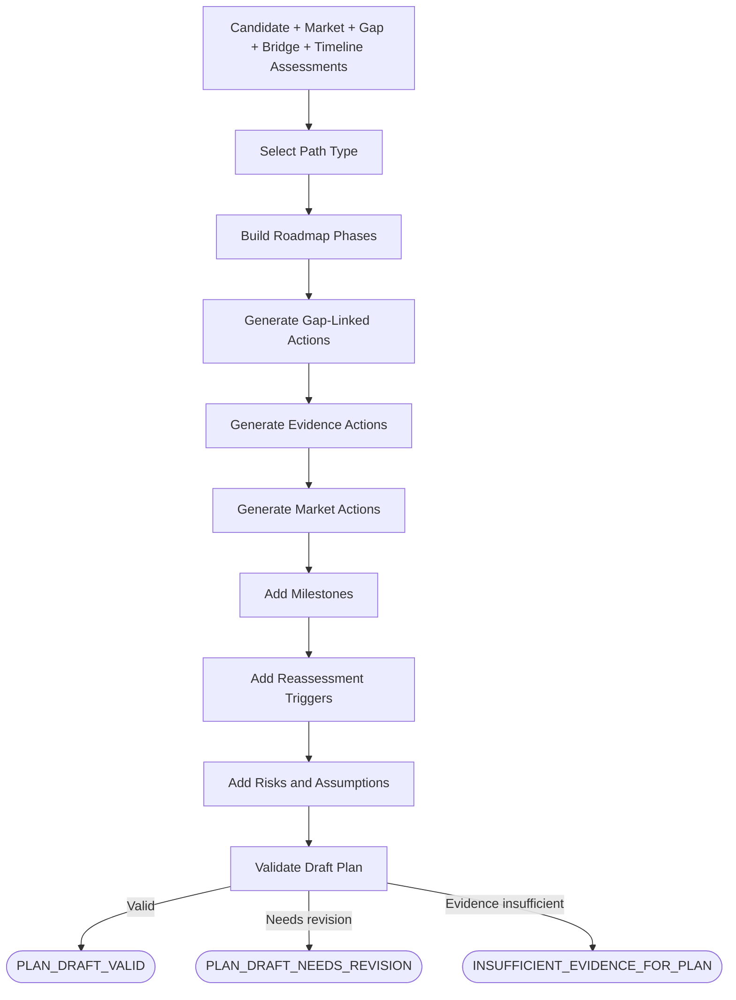

## Final Plan Approval and Workflow Completion

This stage allows the user to review the complete draft Career Strategy Plan before it becomes the approved active plan. It preserves human control, traceability, corrections, rejection, draft saving, safe cancellation, and workflow status. Persistence and interrupt payloads are not implemented here.

### 1. Purpose

The user must review the complete draft before activation. Only `APPROVE_AND_SAVE` can conceptually lead to an approved active plan. An unapproved inference must never become authoritative.

### 2. Input

Use the validated draft plan containing the candidate starting point, career goal, market context, recommended path, bridge role when applicable, Candidate Accessibility, Market Verdict, gap analysis, timeline assessment, roadmap phases, actions, milestones, reassessment triggers, risks, assumptions, confidence, evidence limitations, and source references.

### 3. Final Review Presentation

The review presents candidate interpretation, career goal, market findings, role recommendations, Candidate Accessibility, bridge or no-bridge conclusion, gap analysis, timeline feasibility, roadmap, assumptions, risks, confidence, uncertainty, market sources, and retrieval dates.

The presentation clearly separates confirmed facts, agent interpretations, market evidence, assumptions, and uncertainty.

### 4. User Actions

Support:

- `APPROVE_AND_SAVE`
- `EDIT_PROFILE_OR_PREFERENCES`
- `REVISE_GOAL`
- `REASSESS_MARKET`
- `REASSESS_CAREER_ANALYSIS`
- `REJECT_RECOMMENDATION`
- `SAVE_AS_DRAFT`
- `CANCEL`

The UI and actual approval interrupt are deferred.

### 5. Approve and Save

Conceptually, approval marks the plan approved, records approval intent, and allows later persistence of the approved plan. The final status is `COMPLETED` or `COMPLETED_WITH_LIMITATIONS`, depending on disclosed evidence quality. Saving is not implemented here.

### 6. Edit Profile or Preferences

When candidate facts, location, industry, work mode, bridge willingness, seniority, or other relevant preferences change, return only to the earliest affected stage and recompute downstream results. A candidate-fact change returns to Profile and Goal; a location change returns to Market Intelligence; a bridge-willingness change returns to Career Analysis or Bridge analysis. The entire workflow is not restarted unnecessarily.

### 7. Revise Goal

Changes to target role, target seniority, or target timeline return conceptually to Profile and Goal or its goal-confirmation portion, followed by recomputation of dependent outputs.

### 8. Reassess Market

Requests for wider geography, related titles, different market scope, or a new search return to Market Intelligence. Market Verdict, Candidate Accessibility where required, bridge analysis, timeline, and plan are then recomputed.

### 9. Reassess Career Analysis

The user may challenge transferable-skill interpretation, gap classification, accessibility, or a bridge recommendation. Return to the relevant Career Analysis stage. Disagreement is a valid user decision, not an error.

### 10. Reject Recommendation

Record the rejection conceptually, retain optional feedback, and do not mark the recommendation approved. Offer reassessment, alternative paths, draft saving, or cancellation.

### 11. Save as Draft

The user may save the plan later as `SAVED_AS_DRAFT`. Its assumptions and evidence references remain traceable, but it is not approved or active. Persistence is not implemented here.

### 12. Cancel

Cancellation produces `USER_CANCELLED`. Only previously approved authoritative information may be preserved later; an unapproved plan is not made active.

### 13. Completed with Limitations

Use `COMPLETED_WITH_LIMITATIONS` when the user approves a useful plan with disclosed limitations, such as unavailable historical evidence, blocked pages, partial current evidence, moderate bridge confidence, or low timeline confidence. Limitations remain visible in the approved plan.

### 14. Failure Outcomes

Use `INSUFFICIENT_EVIDENCE` when a credible plan cannot be produced. Use `FAILED` only for unrecoverable technical or system failure. Rejected recommendations, missing historical evidence, one failed tool, or major candidate gaps are not technical failures.

### 15. Workflow Final Statuses

The workflow outcomes are:

- `COMPLETED`
- `COMPLETED_WITH_LIMITATIONS`
- `SAVED_AS_DRAFT`
- `USER_CANCELLED`
- `INSUFFICIENT_EVIDENCE`
- `FAILED`

These are workflow outcomes, not career judgments.

### 16. Recomputation Principle

When information changes, recompute only downstream stages whose inputs are affected:

- Profile change → Profile and Goal → affected Market Intelligence → Career Analysis → Career Plan
- Location change → Market Intelligence → Career Analysis → Career Plan
- Timeline-only change → Timeline Assessment → Career Plan
- Rejected bridge role → Bridge Analysis → Timeline → Career Plan

This is conceptual dependency-aware recomputation and is not implemented here.

### 17. Approval Traceability

Conceptually retain what was shown, the reviewed plan version, user action, feedback, timestamp, and whether limitations were acknowledged. No final schema is defined.

### 18. Final Workflow Output

Conceptually produce workflow status, approved or draft plan reference, final plan version, approval status, limitations, user feedback, reassessment recommendation, final confidence, and source/evidence references. No final schema is defined.

### 19. Final Plan Approval Diagram

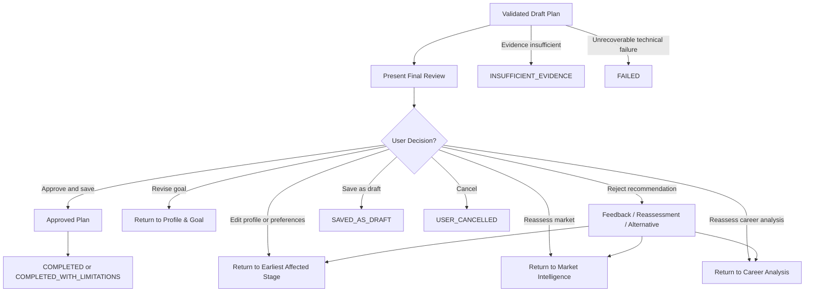

### 20. Must Not

The workflow must not activate a plan without approval, treat rejection as technical failure, hide limitations, discard feedback, force acceptance, restart unnecessarily, save unapproved inference as authoritative, or guarantee career outcomes.

## Historical Market Evidence Workflow

This workflow analyzes historical market evidence to supplement, not replace, the current market snapshot. It uses current market evidence and credible historical market evidence when available. Current postings alone must not be used to infer year-round availability or long-term trends.

### 1. Purpose

Historical analysis helps assess whether a role is consistently available, seasonal, increasing, stable, declining, unusual in the current snapshot, or observed regularly across months or quarters.

### 2. Role Scope

Historical analysis may operate at these levels:

- **Exact title:** Product Owner
- **Related-title group:** Product Owner, Technical Product Owner, and Platform Product Owner
- **Normalized role family:** Product Management
- **Occupational family or official occupation classification**

Broader levels may be used only when exact-title history is unavailable. The workflow preserves which level was used. Exact-title, related-title, role-family, and occupational-family evidence remain distinguishable.

### 3. Historical Data Source

Conceptually request historical evidence from an approved historical-market source. The final provider remains unresolved.

Potential source types include government labor-market datasets, job-posting trend datasets, occupational statistics, role-family historical datasets, and internally accumulated weekly snapshots later. No source is selected in this activity.

### 4. Historical Data Availability

Possible outcomes are:

- `HISTORICAL_DATA_AVAILABLE`
- `HISTORICAL_DATA_PARTIAL`
- `HISTORICAL_DATA_UNAVAILABLE`

When historical data is unavailable, return `INSUFFICIENT_HISTORICAL_EVIDENCE` and continue using current-market evidence. Historical-data absence must not fail the entire career analysis.

### 5. Coverage Validation

Conceptually validate:

- Start date and end date
- Observation frequency
- Missing periods
- Geography
- Role scope
- Employer coverage when available
- Whether data represents postings, vacancies, or broader employment statistics

Weekly, monthly, and quarterly observations must remain distinct and must not be treated as equivalent. Missing periods must not be fabricated.

### 6. Exact Title versus Role Family

When exact-title history is unavailable but role-family or occupational evidence exists, the workflow may continue with the broader evidence and lower or qualify confidence. The final output must state:

> The current market analysis is based on exact and related job titles. The historical analysis uses the broader role family / occupation because exact-title historical coverage is unavailable.

This substitution must never be hidden.

### 7. Persistence Analysis

Conceptually evaluate months with observed activity, weeks with observed activity, median posting or vacancy volume, periods with no observed activity, distinct employers when available, and whether demand appears continuous or intermittent.

Possible classifications:

- `PERSISTENT`
- `FREQUENT`
- `INTERMITTENT`
- `SEASONAL`
- `SPARSE`
- `INSUFFICIENT_EVIDENCE`

Final numeric thresholds are intentionally undefined.

### 8. Trend Analysis

Conceptually evaluate increasing, stable, declining, volatile, or unclear activity. Possible classifications are:

- `RISING`
- `STABLE`
- `DECLINING`
- `VOLATILE`
- `UNCLEAR`
- `INSUFFICIENT_EVIDENCE`

Short-term spikes must not be treated as long-term trends.

### 9. Seasonality Analysis

Conceptually evaluate clustering around specific months or quarters, graduation cycles, budget cycles, year-end or new-year hiring cycles, and industry-specific hiring periods.

Possible classifications are:

- `NON_SEASONAL`
- `MILD_SEASONALITY`
- `STRONG_SEASONALITY`
- `UNCLEAR`
- `INSUFFICIENT_EVIDENCE`

Seasonality must not be inferred from too little data.

### 10. Employer Concentration

When employer data exists, conceptually evaluate whether activity comes from many employers, is concentrated in a few employers, or is distorted by one large hiring campaign.

Possible classifications are:

- `DIVERSE`
- `MODERATELY_CONCENTRATED`
- `HIGHLY_CONCENTRATED`
- `UNKNOWN`

Final thresholds are intentionally undefined.

### 11. Historical Confidence

Use the levels `HIGH`, `MODERATE`, `LOW`, and `INSUFFICIENT`.

Confidence depends conceptually on time span, observation frequency, missing periods, data quality, geography match, role-title match, and whether exact-title or broader role-family data is used. Confidence must be explained rather than reduced to an unexplained percentage.

### 12. Historical Market Signal

Conceptually produce a historical signal containing:

- Role or role family
- Geography
- Time period
- Data-source type
- Exact-title or broader-family indicator
- Persistence classification
- Trend classification
- Seasonality classification
- Employer concentration when available
- Confidence
- Limitations

No final schema is defined yet.

### 13. Combine with Current Market Snapshot

The historical signal does not replace current-market data. It is combined conceptually with the Current Market Snapshot for a later market interpretation.

Examples include:

- Current market strong plus historical persistent → Broad and persistent may later be possible.
- Current market weak plus historical persistent → Current slowdown may be temporary.
- Current market strong plus historical sparse → Possible temporary spike or emerging demand.
- Historical data unavailable → Current-market conclusion only, with historical confidence insufficient.

Final market-verdict rules remain deferred.

### 14. Product Owner Example

For “Are Product Owner roles available throughout the year?” the workflow separately analyzes current Product Owner postings, seeks credible historical Product Owner or related role-family evidence, determines whether exact-title history exists, and discloses broader product-management evidence when that is all that is available. It evaluates persistence, trend, seasonality, and confidence, but does not claim year-round availability without supporting evidence. No counts or trends are invented.

### 15. UiPath / RPA Example

For “Is the UiPath / RPA market stable?” the workflow separates UiPath-specific title history from broader RPA or Intelligent Automation history. Broader occupational or role-family evidence is used only when necessary, and the distinction is preserved. If no credible historical signal exists, it returns insufficient evidence rather than inventing a conclusion.

### 16. Failure and Limitation Paths

For a historical provider outage, wrong geography, unavailable exact-title history, unclear role family, missing periods, too-short range, vacancy-versus-posting mismatch, employer concentration, or stale data, the workflow may use a broader role family, use a broader time window, lower confidence, return partial evidence, or return insufficient evidence. It must not fabricate missing periods.

### Historical Market Evidence Diagram

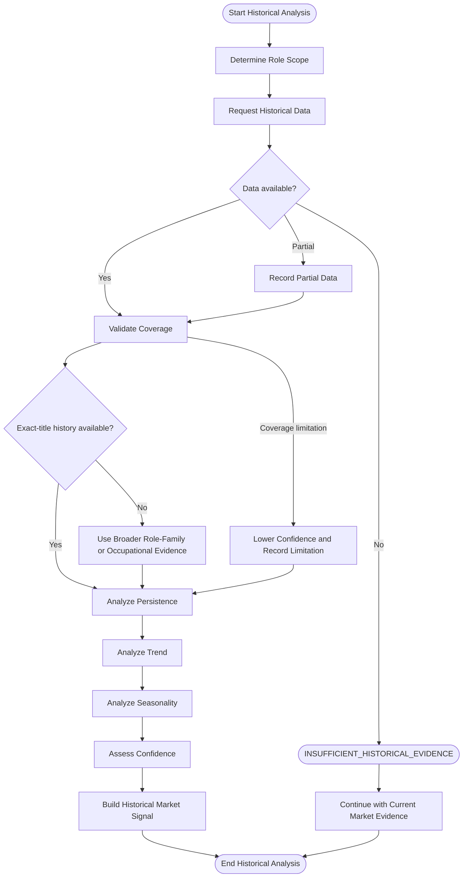

### 3. Market Intelligence Stage

**Purpose:** Understand the current market and credible historical market evidence when available.

Conceptual responsibilities:

- Search exact titles
- Search related titles
- Retrieve selected job pages
- Analyze role requirements
- Normalize role families
- Analyze current market metrics
- Analyze historical signals when available
- Determine whether market evidence is sufficient

Possible outcomes:

- Market evidence sufficient
- Related-title expansion required
- Geography expansion required
- Historical evidence unavailable
- Insufficient market evidence
- Search failure requiring retry or degraded mode

### 4. Career Analysis Stage

**Purpose:** Compare candidate evidence with market requirements.

Conceptual responsibilities:

Case_ID	Expected_Career_Verdict	Predicted_Career_Verdict	Verdict_Exact_Match	Actual_Strengths	Actual_Gaps	Actual_Match_Types	Actual_Gap_Severity	Evidence_Groundedness	Verdict_Reasonableness	Evidence_Coverage	Overall_PASS_FAIL	Latency	Token_Usage	Cost	LangSmith_Trace_ID
CN-001	ready_now		0								FAIL	0.994 seconds	0		e5a0b462-c677-4ab9-a1c9-4c7c9f018781
CN-002	strong_fit_minor_gaps		0								FAIL	1.71 seconds	0		75c2b5f5-7cfc-420b-9008-25af2d526e43
CN-003	strong_fit_minor_gaps		0								FAIL	13.989 seconds	0		e2011660-560b-49c0-aa08-477c0f4db1ae
CN-004	ready_now	insufficient_evidence	0	Senior Java Developer with 7 years of experience building enterprise web applications using Java, S…	Java; Computer Science or Software Engineering Degree	Partial Match; No Match	Material; Major				FAIL	177.844 seconds	30,844		56086f76-3277-43e8-95e1-1641e632649b
CN-005	strong_fit_minor_gaps		0								FAIL	2.895 seconds	0		cb557027-2f8e-400d-9498-f51f3e7e9ab7
CN-006	adjacent_fit		0								FAIL	452.058 seconds	16,023		12ba0060-7c3c-434d-9e3e-f93d776b16b6
CN-007	adjacent_fit		0								FAIL	305.606 seconds	19,513		86148f53-48b0-4671-93c9-9bce955c863d
CN-008	adjacent_fit		0								FAIL	44.979 seconds	4,816		a1c1530c-bbfa-47e5-be49-eec2a24c1df7
CN-009	significant_upskilling		0								FAIL	357.306 seconds	17,944		e660a251-31d4-4425-b796-221b38caabc0
CN-010	significant_upskilling		0								FAIL	81.34 seconds	7,072		b34d8d10-6aaf-4611-a3e1-1e783516f6c4- Identify transferable capabilities
- Classify gaps
- Identify hard blockers
- Classify role accessibility
- Identify direct-fit, adjacent, bridge, aspirational, poor-fit, and insufficient-evidence roles
- Assess timeline feasibility

Possible outcomes:

- Direct path identified
- Bridge role recommended
- No valid bridge role
- Insufficient candidate evidence
- Target ambiguous
- Timeline assessed

### 5. Career Plan Stage

**Purpose:** Turn analysis into an actionable career strategy.

Conceptual responsibilities:

- Build a career path
- Generate a phased roadmap
- Add skills, experience, leadership/scope, and evidence actions
- Add market actions
- Add milestones
- Add risks and uncertainties
- Assemble the Career Strategy Report

Possible outcomes:

- Draft plan ready
- Plan validation failed
- More evidence required

### 6. Final Approval Stage

**Purpose:** Allow the user to review and approve the final plan.

Possible outcomes:

- Approve and save
- Revise preferences
- Reject recommendation
- Save as draft
- Cancel

The specific approval gates and interrupt payloads are not defined in this activity.

### 7. Finalize Run

**Purpose:** Close the analysis run and return the final status.

Possible statuses:

- `COMPLETED`
- `COMPLETED_WITH_LIMITATIONS`
- `SAVED_AS_DRAFT`
- `USER_CANCELLED`
- `INSUFFICIENT_EVIDENCE`
- `FAILED`

## Default Parent Flow

```text
Initialize Run
→ Profile and Goal
→ Market Intelligence
→ Career Analysis
→ Career Plan
→ Final Approval
→ Finalize Run
```

## Major Conditional Branches

### A. Profile Incomplete

Profile and Goal Stage → Request additional user information → Return to Profile and Goal Stage.

### B. Goal Ambiguous

Profile and Goal Stage → Request clarification → Return to Profile and Goal Stage.

### C. Exact-Title Market Evidence Weak

Market Intelligence Stage → Search related titles → Re-evaluate evidence.

### D. Market Evidence Still Weak

Market Intelligence Stage → Broaden geography only if the user permits it → Re-evaluate evidence.

If evidence remains weak, continue with an insufficient-evidence status or stop safely when analysis would be misleading.

### E. Historical Evidence Unavailable

Do not fail the entire workflow. Continue using current market evidence and mark historical confidence as insufficient.

### F. Candidate Evidence Insufficient

Career Analysis Stage → Request targeted clarification where useful, or continue with lower confidence and an insufficient-candidate-evidence result.

### G. Direct Path Exists

Career Analysis Stage → Career Plan Stage. Do not force a bridge role.

### H. Bridge Role Required

Career Analysis Stage → Identify and rank bridge options → Career Plan Stage.

### I. No Valid Bridge Role

Career Analysis Stage → Career Plan Stage. The final plan explicitly states that no credible bridge role was identified.

### J. Timeline Unrealistic

Career Analysis Stage → Career Plan Stage. The roadmap explains intermediate milestones or an alternative timeline; the workflow does not stop solely because the timeline is unrealistic.

### K. Final Plan Rejected

Final Approval Stage → User chooses what to revise. Potential routes are:

- Return to Profile and Goal Stage
- Return to Market Intelligence Stage
- Return to Career Analysis Stage
- Save as draft
- Cancel

The exact implementation is deferred.

## Human-in-the-Loop Locations

At parent-workflow level, human interaction occurs at:

1. Profile confirmation
2. Goal confirmation
3. Clarification when required
4. Final plan approval

Detailed interrupt payloads and approval gates will be defined later.

## Degraded Mode

The workflow may continue in degraded mode when:

- Historical data is unavailable
- Some job pages cannot be retrieved
- One search query fails but sufficient evidence remains
- One model provider fails and a fallback succeeds

Limitations must be clearly displayed.

Degraded mode must not be used when:

- Candidate identity or profile facts are unreliable
- Mandatory approval is missing
- Market evidence is too weak for a credible recommendation
- Structured output cannot be validated after retries

## Stop Conditions

The workflow may safely stop when:

- The user cancels
- A profile cannot be established
- A goal cannot be clarified sufficiently
- Mandatory prerequisite information is required but unavailable
- Market evidence is insufficient for the requested analysis
- Model outputs remain invalid after retry or fallback
- A critical persistence failure prevents approved data from being saved

## Parent Workflow Diagram

```mermaid
flowchart TD
    start([START]) --> profile[Profile & Goal]
    profile -->|Profile or goal clarification| clarification[Request clarification]
    clarification --> profile
    profile -->|Confirmed| market[Market Intelligence]
    profile -->|User cancels| end_cancel([END: USER_CANCELLED])

    market -->|Exact-title evidence weak| related[Expand related titles]
    related --> market
    market -->|Evidence still weak and permission exists| geography[Expand geography]
    geography --> market
    market -->|Historical evidence unavailable| analysis[Career Analysis]
    market -->|Sufficient or degraded evidence| analysis
    market -->|Insufficient evidence| insufficient([END: INSUFFICIENT_EVIDENCE])
    market -->|Retry or degraded mode| market

    analysis -->|Direct path| plan[Career Plan]
    analysis -->|Bridge required| bridge[Identify and rank bridge options]
    bridge --> plan
    analysis -->|No valid bridge role| no_bridge[Record no valid bridge role]
    no_bridge --> plan
    analysis -->|Clarification needed| clarification_analysis[Request targeted clarification]
    clarification_analysis --> analysis
    analysis -->|Timeline assessed| plan

    plan -->|Draft ready| approval[Final Approval]
    plan -->|More evidence or validation issue| analysis
    approval -->|Approve and save| finalize[Finalize Run]
    approval -->|Revise preferences or recommendation| revision[Select revision route]
    revision --> profile
    revision --> market
    revision --> analysis
    approval -->|Save as draft| draft[Finalize as draft]
    draft --> finalize
    approval -->|Cancel| end_cancel
    finalize --> end([END])
```
